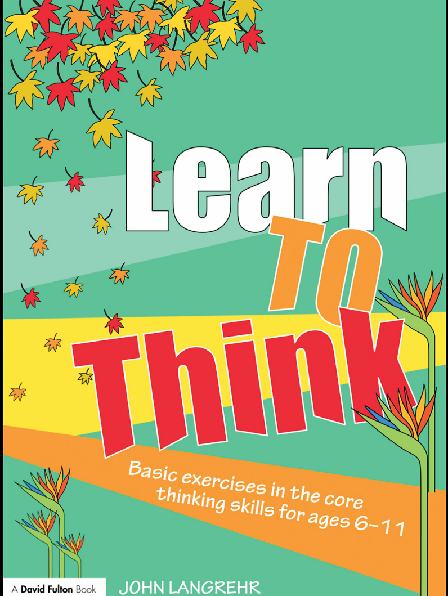

《学会思考》——为6到11岁孩子准备的核心思考能力基础练习。约翰·朗格里尔

2003年首次由澳大利亚 Curriculum Corporation 出版，2003年重印，2008年由 Routledge 2 Park Square, Milton Park, Abingdon, Oxon OX14 4RN 出版。

该书在美国和加拿大由 Routledge（270 Madison Avenue, New York, NY 10016）同时出版。Routledge 是 Taylor & Francis Group（一家 informa 公司的）品牌。本版于 2008 年在 Taylor & Francis e-Library 发布。“如需购买本书或 Taylor & Francis 和 Routledge 的数千本电子书，请访问 www.eBookstore.tandf.co.uk。”

© 2008 约翰·朗格里尔。各出版社将在各自区域负责版权登记及必要的版权维护。

版权所有，未经出版社书面许可，本书任何部分不得以任何形式或任何已知或日后发明的电子、机械或其他方式复制、印刷、录音或存储于任何信息检索系统中。英国图书馆出版编目数据：本书的编目记录可在英国图书馆查阅。美国国会图书馆编目数据：Langrehr, John.

《学会思考》：6-11岁核心思考能力基础练习 / 约翰·朗格里尔.

p. cm. - (思维课程)

ISBN 978-0-415-46590-8 1. 思维与思考 - 学习与教学。2. 小学教学。I. 标题.

LB1590.3.L37 2008 370.15′2-dc22 2007048651 ISBN 0-203-92645-5 Master e-book ISBN ISBN 10: 0-415-46590-7 (pbk)
ISBN 10: 0-203-92645-5 (ebk)
ISBN 13: 978-0-415-46590-8 (pbk)
ISBN 13: 978-0-203-92645-1 (ebk)

# 目录

介绍

**组织性思维（整理信息）&#x20;**

1\. 观察特征 5&#x20;

2\. 观察相似点 8&#x20;

3\. 观察不同点 11&#x20;

4\. 分类 14&#x20;

5\. 比较 17&#x20;

6\. 按大小和时间排序 20&#x20;

7\. 思考概念 26&#x20;

8\. 概括 29&#x20;

9\. 概念图 33&#x20;

**分析思维**&#x20;

10\. 分析关系 41&#x20;

11\. 分析序列模式 44&#x20;

**评价性思维**&#x20;

12\. 区分事实和观点 49&#x20;

13\. 区分肯定和不肯定的结论 52&#x20;

14\. 挑战说法的可靠性 56&#x20;

15\. 区分相关和无关信息 60&#x20;

16\. 决策 64&#x20;

17\. 考虑其他观点 70&#x20;

18\. 提出更好的问题 73&#x20;

**创造性思维**&#x20;

19\. 创造性后果 78&#x20;

20\. 逆向创造性思考 81&#x20;

21\. 分析设计的创造性 84&#x20;

22\. 随机物体的创造力 88&#x20;

23\. 视觉创造力 91&#x20;

24\. 关于用途的创造性思考 93

# 介绍

小朋友需要先学知识，才能动脑筋。  
你也要学会一些思考方法，用来思考学到的东西。  
试试看：想一想今天学到的新知识，可以问自己什么问题？

'Metacognition'（想想自己怎么想）就像一个思考工具箱，  
能帮你用不同工具来解决问题。  
试试看：想一想上次自己解决问题时，是怎么想的？

有些人以为我们能自然而然地学会这些思考方法，可研究发现并不是这样。  
我们经常用大约二十种“核心思考能力”（基本思考方法）来整理和理解信息，这些都写在目录里。  
试试看：试着数一数你今天用了几种思考小工具？

本书里的练习单能让你动手练习这些思考方法，  
并学会在思考时该问自己的问题。

本书里的思考方法分为四类：组织思考（分类信息）、分析思考（看出关系和模式）、评价思考（判断对错），以及创造性思考（想新点子）。  
试试看：选一类，想想每天何时会用到它？

练习内容包括数学、语文、社会和科学。

每课开始都有**导学笔记**（本课第一页），老师可以和同学一起讨论。

这一页还有一个示例，老师可以带着同学一起做，  
说明接下来练习题想要什么答案。

当你明白了方法，就可以做复印好的**学生**练习单上的题目。  
然后本书还会提供一些**建议答案**。

最后，大多数练习后面会有一些有用的问题，帮助你在思考时自问。  
老师可以让同学把这些问题写在自己的练习单上。

这些处理问题的小清单就像思考程序（小程序）一样，  
能帮你进行比较、分类、区分事实和观点、概括等等。

这本书有足够的练习，可以当成6～11岁小朋友的思考能力培养课程。

  
John Langrehr

# 观察事物的特点

* 我们身边不管是人做的东西，还是大自然的东西，都有它的设计（样子和构造）。每个设计都有它特别的理由，就像你挑生日蛋糕的样子一定是因为喜欢那个样子或味道。试试看：找一样你喜欢的东西，想想它为什么长这样。

* 我们说每个东西的设计（样子和结构）都有特定的用途（功能）。我们天天看很多东西，却很少问自己它为什么会这样做，就像看到滑梯，你会想为什么滑梯弯弯的而不是直的吗？试试看：选择一个你常用的东西，想想它是为了什么用才做成这样的。

* 第1课教你用更仔细或更用心的眼光看事物。当你看着身边的世界并动动脑筋，生活会变得更有趣，就像观察小蚂蚁搬食物会发现它们的本领。试试看：找一个小东西，用心观察它3分钟，记下你发现的细节。

* 为了帮助你关注你正在观察事物的特点

记住缩写 **SCUMPS**，每个字母都帮你问自己：为什么它有 大小（Size）、颜色（Colour）、用途（Use）、材料（Material）、部件（Parts）和 形状（Shape），而不是其他可能？试试看：选一样东西，用 SCUMPS 问自己每个问题。

| Example Object | Properties      | Reasons for properties              |
| -------------- | --------------- | ----------------------------------- |
| brick          | rough           | cement sticks to its surface easily |
|                | heavy           | wind won't blow it away             |
|                | geometric shape | easy to stack on each other in rows |
|                |                 |                                     |

| 物品  | 属性     | 具备属性的原因/用意    |
| --- | ------ | ------------- |
| 砖块  | 表面粗糙   | 水泥可以轻松的粘到砖块表面 |
|     | 比较沉    | 风不容易吹走        |
|     | 形状是长方体 | 容易摞起来         |

## 学生练习单

在每个特点后写上你觉得它为什么有这个特点的原因。

| 物体     | 特点 | 特点原因 |
| ---------- | ---------- | ---------------------- |
| 硬币       | -          | -                      |
| -          | -          |                        |
| -          | -          |                        |
| 旗子       | -          | -                      |
| -          | -          |                        |
| -          | -          |                        |
| 树         | -          | -                      |
| -          | -          |                        |
| -          | -          |                        |
| -          | -          |                        |
| 车胎       | -          | -                      |
| -          | -          |                        |
| 瓶子       | -          | -                      |
| -          | -          |                        |
| -          | -          |                        |
| 足球       | -          | -                      |
| -          | -          |                        |
| -          | .          |                        |

现在，请像小侦探一样仔细看下面这些东西。  
写出它们各自三个你注意到的特征。  
试试看：拿一枚硬币，说说它三个不同的特征。

### 观察时可以问自己的好问题

* 试试看：想一个问题来帮你更好地观察物体。
