学会思考：6–11 岁儿童的核心思维技能基础练习 约翰·朗雷尔

首次由澳大利亚课程公司于 2003 年出版 2003 年再版 2008 年由劳特利奇出版公司出版 2 Park Square, Milton Park, Abingdon, Oxon OX14 4RN  
同时由劳特利奇在美国和加拿大出版 270 Madison Avenue, New York, NY 10016  
劳特利奇是英孚思集团（Taylor & Francis Group，informa business）的一个品牌  
本版本发表于 Taylor & Francis e-Library，2008 年。  
“要购买本书或泰勒与弗朗西斯／劳特利奇数千种电子书的个人副本，请访问 www.eBookstore.tandf.co.uk。”  
© 2008 约翰·朗雷尔  
各出版商将分别负责在其所属地区办理著作权登记及必要的维权事宜。

版权所有。未经出版商书面许可，不得以任何形式或任何已知或将来发明的电子、机械或其他手段（包括影印和录音）将本书全部或部分转载、复制、利用，或用于任何信息存储与检索系统。  
英国图书馆出版编目数据 本书的目录记录可从英国图书馆获得  
美国国会图书馆编目数据 Langrehr, John.  
Learn to think : basic exercises in the core thinking skills for ages 6-11 / John Langrehr.  
p. cm. – (Thinking lessons)  
ISBN 978-0-415-46590-8  1. 思考与思维–研究与教学 2. 小学教学 I. 标题.  
LB1590.3.L37 2008 370.15′2-dc22 2007048651  
ISBN 0-203-92645-5 主电子书 ISBN  
ISBN 10: 0-415-46590-7 (平装)  
ISBN 10: 0-203-92645-5 (电子)  
ISBN 13: 978-0-415-46590-8 (平装)  
ISBN 13: 978-0-203-92645-1 (电子)

# 目录

Introduction

**组织性思维&#x20;**

1\. 观察属性 5&#x20;  
2\. 观察相似性 8&#x20;  
3\. 观察差异 11&#x20;  
4\. 分类 14&#x20;  
5\. 比较 17&#x20;  
6\. 按大小和时间排序 20&#x20;  
7\. 概念思考 26&#x20;  
8\. 归纳 29&#x20;  
9\. 概念图 33&#x20;  

**分析性思维&#x20;**

10\. 分析关系 41&#x20;  
11\. 分析序列中的模式 44&#x20;  

**评估性思维&#x20;**

12\. 区分事实与观点 49&#x20;  
13\. 区分确定性与不确定性结论 52&#x20;  
14\. 质疑主张的可靠性 56&#x20;  
15\. 区分相关与无关信息 60&#x20;  
16\. 决策 64&#x20;  
17\. 考虑其他观点 70&#x20;  
18\. 提出更好的问题 73&#x20;  

**创造性思维&#x20;**

19\. 创造性后果 78&#x20;  
20\. 逆向创造性思维 81&#x20;  
21\. 分析设计的创造性 84&#x20;  
22\. 随机物体的创造力 88&#x20;  
23\. 视觉创造力 91&#x20;  
24\. 关于用途的创造性思维 93

# 简介

学生需要学习可供思考的内容，也需要学习可用于思考这些内容的思维过程。换句话说，他们需要掌握一些在不同方式思考内容时可自问的好问题。“元认知”（关于思维的思维）赋予他们力量，使他们拥有丰富的可用认知工具。课程规划者常假设学生能够自然而然地学会这些过程，但研究表明事实并非如此。我们经常使用大约二十种基础或 **核心思维技能** 来连接并理解信息。这些技能列在目录页中。本书中的练习让学生反复练习这些过程，并学会在使用时可问自己的有用问题。

本书中的思维过程涵盖组织性、分析性、批判性或 **评估性** 和 **创造性思维**。所涉内容包括数学、语言、社会研究和科学。本书的每课以教师与学生讨论用的 **导言说明**（课首页面）开篇。该页面还包含一个由教师演示的示例，用以说明后续练习所需要的内容。当学生理解了思维过程后，可在影印的 **学生**练习单 上完成相应题目。接着提供一些 **建议答案**。最后，在大多数练习末尾列出一些学生在不同思维方式中可自问的有用问题。教师可将这些问题与学生分享，让他们记录在自己的练习单末尾。这些处理性问题列表可被视为比较、分类、区分事实与观点、归纳等思维方式的思维程序。本书提供了足够的练习，可作为约 6–11 岁学生思维技能项目的基础。

John Langrehr

# 观察属性

* 我们周围所有由人类或大自然创造的事物都有其设计。 - 任意事物的设计或构成都是独特的，并且存在特定的原因。瓶子并不是偶然由玻璃而非其他材料制成。红绿灯并不是偶然是红色而不是其他颜色。树木也不是偶然有成千上万的叶子而不是 10 或 20 片。

* 我们说某事物的设计符合特定的用途。 - 我们都在看事物，但通常不会问自己为什么某物具有这样的设计，而不是其他设计。

* 第 1 课 教你更仔细或更用心地观察事物。 - 如果你观察并思考周围的世界，生活将变得更加有趣。你将开始理解创作者为什么要以那种方式设计事物。

* 为帮助你专注于所观察事物的属性，请记住首字母缩略词 **SCUMPS**。这个单词的每个字母都可以帮助你询问自己，为什么某物具有当前的尺寸（Size）、颜色（Colour）、用途（Use）、材料（Material）、部件（Parts）和形状（Shape），而不是其他可能性。

| Example Object  | Properties                          | Reasons for properties              |
| --------------- | ----------------------------------- | ----------------------------------- |
| 砖块            | 粗糙                                | 水泥易于粘附其表面                  |
| 重              | 不会被风吹走                        |                                     |
| 几何形状        | 易于成行堆叠                        |                                     |

## 学生练习单

在每个属性后填写你认为该事物具有此属性的原因。

| 对象        | 属性 | 属性原因 |
| ----------- | ---- | -------- |
| 硬币        | -    | -        |
| -           | -    |          |
| -           | -    |          |
| 旗帜        | -    | -        |
| -           | -    |          |
| -           | -    |          |
| 树          | -    | -        |
| -           | -    |          |
| -           | -    |          |
| -           | -    |          |
| 汽车轮胎    | -    | -        |
| -           | -    |          |
| 一个瓶子    | -    | -        |
| -           | -    |          |
| -           | -    |          |
| 一个足球    | -    | -        |
| -           | -    |          |
| -           | .    |          |

写下以下每个事物的三个你注意到的属性。

### 在观察时可自问的有用问题

* &#x20;&#x20;

## 可能的答案

| 对象        | 属性            | 属性原因                           |
| ----------- | --------------- | ---------------------------------- |
| 硬币        | 圆形            | 易于拿取/存放                      |
|             | 金属制          | 不易弯曲                           |
|             | 薄              | 轻                                 |
|             | 正面            | 展示国家历史                       |
|             |                 |                                    |
| 旗帜        | 彩色            | 易于识别                           |
|             | 有图案          | 代表人民                           |
|             | 布制的          | 不易撕裂                           |
|             | 矩形            | 易于制作                           |
| 树          | 树叶            | 吸收气体                           |
|             | 树根            | 使树保持稳定                       |
|             | 圆形树干        | 提供结构强度                       |
|             | 竖直            | 以便获得阳光                       |
| 汽车轮胎    | 圆形            | 易于滚动                           |
|             | 橡胶制          | 灵活                               |
|             | 中空            | 用于弯曲                           |
|             | 有槽纹          | 提供路面抓地力                     |
| 一个瓶子    | 玻璃制          | 易于清洁/可透视                    |
|             | 圆柱形侧面      | 提供强度                           |
|             | 瓶颈窄          | 易于倒出                           |
|             | 平底            | 易于立放                           |
| 一个足球    | 皮革制          | 易于接球/踢射                      |
|             | 椭圆形          | 易于接球/踢射，弹跳随机            |
|             | 中空            | 轻便，易于踢射                     |

  
### 有用的观察时要提出的问题

* 这个事物具有什么 大小、颜色、用途、材料、部分 和 形状（SCUMPS）？
* 为什么这个事物具有这种 大小、颜色、用途、材料、部分 和 形状，而不是其他的 大小、颜色、用途、材料、部分 和 形状？

# 观察相似之处

* 我想知道你是否想过两个或多个事物是如何相似的？
* 例如，你见过柠檬和香蕉，但你是否想过这两种水果有哪些相似之处？
* 我们能想出至少四种这两种水果相似的方式吗？

还记得第1课中提到的 SCUMPS 一词吗？这些水果的 大小、颜色、用途、材料、部分 或 形状 是否相似？

**示例**

| Things           | similar properties                       |
| ---------------- | ---------------------------------------- |
| Banana&#xA;lemon | 两者：黄色食物厚皮在树上生长 |

## 学生练习单

| **事物**            | **3个相似属性** |
| ------------------- | ------------------------ |
| flowersbirds        |                          |
|                     |                          |
|                     |                          |
| roadriver           |                          |
|                     |                          |
| chairhorse          |                          |
|                     |                          |
| doorbook            |                          |
|                     |                          |
|                     |                          |
| the numbers 4 and 9 |                          |
|                     |                          |
|                     |                          |
| the words fell, ran |                          |
|                     |                          |
|                     |                          |
| a squarea circle    |                          |
|                     |                          |
|                     |                          |

### 在观察相似之处时要自问的问题

*

***

## 可能的答案

| Things             | 3 similar properties                                                                             |
| ------------------ | ------------------------------------------------------------------------------------------------ |
| flowersbirds       | 有生命，需要阳光/空气/水，不同种类/颜色                                                           |
|                    |                                                                                                  |
| roadriver          | 有名称，可用于运输，有起点和终点                                                                 |
|                    |                                                                                                  |
| chairhorse         | 可以坐，有四条腿，不同高度，不同颜色                                                             |
|                    |                                                                                                  |
| doorbook           | 由木材/树木制成，矩形，人造，可打开                                                               |
|                    |                                                                                                  |
| the numbers4 and 9 | 都是一位数字，有整数平方根，可整除36                                                              |
|                    |                                                                                                  |
| the wordsfell, ran | 都是动词，含有一个元音，是过去式，无大写字母，辅音/元音/辅音的模式                               |
|                    |                                                                                                  |
| a squarea circle   | 封闭图形，二维，几何图形                                                                         |
|                    |                                                                                                  |

### 当观察相似之处时可以问自己的有用问题&#xA;

* 这些事物具有什么尺寸、颜色、用途、材质、部件和形状 (SCUMPS)？
* 这些事物在尺寸、颜色、用途、材质、部件和形状上是否都相同？

***

# 观察差异

注意事物之间的差异同样很有用。例如，猫和狗可能相似之处在于它们都是有生命的，都是动物，都有四条腿，或者都吃肉。然而，只有猫会喵叫或爬树。下次被野狗追赶时，这一点会很有用！本课旨在检测你是否已经注意并储存了事物之间的小差异。

示例

| 事物    | 3 个不同属性                          |
| ------ | ----------------------------------------------- |
| catdog | 只有猫可以：- 爬树- 喵叫- 捉老鼠 |
|        |                                                 |
|        |                                                 |

***

## 学生练习单

| 事物                | 3 个不同属性 |
| --------------------- | ---------------------- |
| chairtable            | 仅椅子             |
|                       |                        |
|                       |                        |
|                       |                        |
| crabfish              | 仅螃蟹              |
|                       |                        |
| circletriangle        | 仅圆形            |
|                       |                        |
|                       |                        |
|                       |                        |
| number 4number 11     | 仅数字4          |
|                       |                        |
|                       |                        |
| newspaperbook         | 仅报纸         |
|                       |                        |
|                       |                        |
| arteryvein            | 仅动脉            |
|                       |                        |
|                       |                        |
| presidentqueen        | 仅总统         |
|                       |                        |
|                       |                        |
| democracydictatorship | 仅民主         |
|                       |                        |
|                       |                        |
| pencilnail            | 仅铅笔            |
|                       |                        |
|                       |                        |
| birdbee               | 仅鸟              |
|                       |                        |
|                       |                        |

### 观察差异时可以问自己的问题

*

***

## 可能的答案

| 事物                     | 3 个不同属性                                                           |
| -------------------------- | -------------------------------------------------------------------------------- |
| 椅子和桌子            | 椅子用于坐、每人一把、可加软垫                         |
|                            |                                                                                  |
| 螃蟹和鱼              | 螃蟹有钳子、坚硬的壳、能倒着游、可以在水外生存              |
|                            |                                                                                  |
| 圆形和三角形        | 圆形没有直边、角度或顶点                               |
| 数字4和11           | 4是偶数、非质数、只有1位数                                    |
| 报纸和书籍         | 报纸成本低、每日出版、作者众多、包含最新新闻                         |
| 动脉和静脉            | 动脉壁厚、将血液从心脏输送、数量较少                |
| 民主与专制 | 领导人由人民选举、言论自由、人民可以自由出境 |
| 总统和女王        | 政府首脑、由选举产生、可以是男性                                        |
| 鸟和蜜蜂               | 鸟有两条腿、有血液和骨骼、寿命较长                                    |

***

# 分类

* 我们将相似的事物归入组或类别，然后存储在大脑中。这些类别就像主题文件夹。

* 在我们的“心智文件柜”中，我们有标记为“红色物体”、“生物”、“大型野生动物”等等的文件。

通过将事物组织到类别中，当我们需要时就能快速想出该类别的示例。

* 我们仔细观察和比较的事物越多，大脑中存储的类别示例就越多。

本课中的项目将测试你在心智文件柜中用于对事物进行分类的标签类型。

## 示例

| 事物              | 相同之处在于它们都是…… |
| ----------------- | ----------------------- |
| VenusEarthSaturn  | planets                 |
|                   |                         |
|                   |                         |

## 学生练习单

以下各组中的三种事物在某种程度上相同。请写出它们相同的一个或多个方面？

| 事物                         | 相同之处在于它们都是…… |
| ---------------------------- | ---------------------- |
| 剪刀、磁铁、钉子             |                        |
| 蚂蚁、甲虫、蝴蝶             |                        |
| 冰、雾、蒸汽                 |                        |
| 煤、阳光、铀                 |                        |
| 杠杆、斜面、滑轮             |                        |
| 棉花、羊毛、大麻             |                        |
| 照片、页面、门               |                        |
| 轮胎、硬币、球               |                        |
| 软木塞、冰山、苹果           |                        |
| 数字7、11、13                |                        |
| 三角形、正方形、多边形       |                        |
| 单词 walk、catch、climb      |                        |
| 植物、动物、昆虫             |                        |
|                              |                        |

### 分类时要问自己的问题

* &#x20;

*

***

## 可能的答案

| 事物                          | 相同之处在于它们都是……       |
| ----------------------------- | ----------------------------- |
| 剪刀、磁铁、钉子              | 由金属制成或机械制造          |
| 蚂蚁、甲虫、蝴蝶              | 昆虫                          |
| 冰、雾、蒸汽                  | 由水组成                      |
| 煤、阳光、铀                  | 用于发电                      |
| 杠杆、斜面、滑轮              | 可使工作更轻松的机械          |
| 棉花、羊毛、大麻              | 天然纤维                      |
| 照片、page door               | 矩形的，人造的                |
| 轮胎、硬币、球                | 圆形                          |
| 软木塞、冰山、苹果            | 在水中漂浮                    |
| 数字7、11、13                 | 奇数或质数                    |
| 三角形、正方形、五边形        | 多边形，几何图形              |
| 单词 walk、catch、climb       | 动词                          |
| 植物、动物、昆虫              | 生物                          |

### 分类时要问自己的问题

* 这些事物在大小、颜色、用途、材料、构造、形状或其他属性上是否相似？

# 比较

* 我们已经观察了相似点（第2课）和差异点（第3课）。它们可以结合起来吗？

* 可以。可以同时考虑两件事物的异同。

* 同样，思考你正在比较的两件事物在大小、颜色、用途、材料、构造和形状（SCUMPS）方面的异同可能会对你有所帮助。

## 示例

| 仅鲨鱼（差异）          | 鲨鱼和猫共有（相似点）             | 仅猫（差异）                           |
| ----------------------- | --------------------------------- | -------------------------------------- |
| 游泳、无腿、具有鳃      | 吃肉、拥有血液、拥有尾巴          | 会喵喵叫、能爬树、被当作宠物饲养       |
|                         |                                   |                                        |
|                         |                                   |                                        |
|                         |                                   |                                        |

  
***

## 学生练习单

| 仅树木         | 两者均有/相同 | 仅昆虫       |
| -------------- | ------------- | ------------ |
| -              | -             | -            |
| -              | -             | -            |
| -              | -             | -            |
| 仅恐龙         | 两者均有/相同 | 仅大象       |
| -              | -             | -            |
| -              | -             | -            |
| -              | -             | -            |
| 仅蜗牛         | 两者均有/相同 | 仅螃蟹       |
| -              | -             | -            |
| -              | -             | -            |
| -              | -             | -            |
| 仅国际象棋     | 两者均有/相同 | 仅足球       |
| -              | -             | -            |
| -              | -             | -            |
| -              | -             | -            |
| 仅月球         | 两者均有/相同 | 仅地球       |
| -              | -             | -            |
| -              | -             |              |
| -              | -             |              |
| 仅数字8        | 两者均有/相同 | 仅数字9      |
| -              | -             | -            |
| -              | -             | -            |
| -              | -             | -            |

### 比较时可自问的有用问题

* &#x20;
*

## 可能的答案

| **仅树木**            | **两者均有/相同**   | **仅昆虫**           |
| --------------------- | ------------------ | -------------------- |
| 由木头制成            | 由细胞构成         | 头、眼睛             |
| 根                    | 需要水、空气       | 移动                 |
| 树液                  | 能繁殖             | 产卵、飞行           |
| **仅恐龙**            | **两者均有/相同**   | **仅大象**           |
| 灭绝的                | 食草动物           | 现存                  |
| 爬行动物              | 大腿               | 哺乳动物             |
| 长脖子                | 大身体             | 不产卵               |
| **仅蜗牛**            | **两者均有/相同**   | **仅螃蟹**           |
| 生活在陆地上          | 壳                 | 生活在水中和陆地上   |
| 吃绿叶                | 移动缓慢           | 吃肉                 |
| 有黏液                | 有生命的           | 能啃咬               |
| 夜间出没              | 繁殖               | 爪子                 |
| **仅国际象棋**        | **两者均有/相同**   | **仅足球**           |
| 棋子                  | 选手               | 队伍                 |
| 个体                  | 规则               | 使用球               |
| 棋盘                  | 胜者               | 场地                 |
| **仅月球**            | **两者均有/相同**   | **仅地球**           |
| 无生命                | 圆的               | 生命                 |
| 无水                  | 绕太阳运动         | 有水                 |
| 无空气                | 反射阳光           | 有空气               |
| **仅数字8**           | **两者均有/相同**   | **仅数字9**          |
| 偶数                  | 小于10             | 奇数                 |
| 能整除80              | 能整除72           | 能被3整除            |
| 不是完全平方数        | 有因数             | 完全平方数           |

### 比较时可自问的有用问题

* 第一个事物具有什么属性（SCUMPS）？
* 第二个事物具有此属性吗？

***

# 按大小和时间排序

## 按大小排序

在我们的大脑中，我们也可以将事物以某种顺序或序列组织起来。例如，我们可以根据大小、速度、成本等对事物进行排序。

对事物进行排序和比较都是以有组织的方式在记忆中将它们连接起来的一部分。

### 示例

| 打乱的事物                  | 按递减大小排列             |
| --------------------------- | -------------------------- |
| 森林、树枝、树、细枝        | 森林、树、树枝、细枝       |

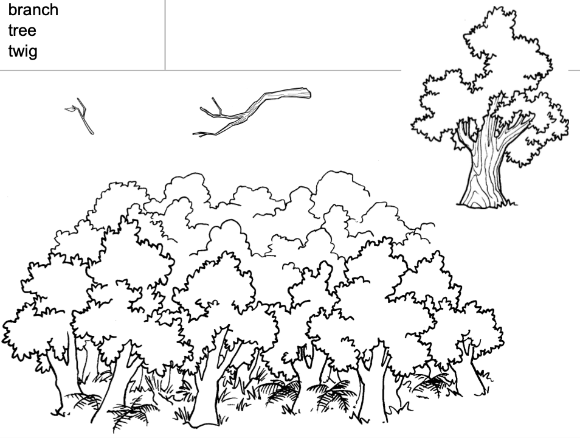

### 学生练习单

下面列出的相关事物顺序已打乱。请从最大开始按大小顺序重新排列。

| 打乱的事物                           | 按递减大小排列             |
| ------------------------------------ | -------------------------- |
| 句子、段落、单词                     |                            |
| 车道、小路、高速公路、道路           |                            |
| 台词、幕、场景、戏剧                 |                            |
| 动脉、血液系统、身体、心脏           |                            |
| 行星、宇宙、月球、太阳               |                            |
| 反射角、锐角、钝角、                  |                            |
| 直角                                 |                            |
| 视网膜、眼睛、感觉系统、杆细胞       |                            |
| 晶体、分子、原子、原子核             |                            |
| 亚洲人、人类、种族、中国人           |                            |
| 国家、社区、女儿、家庭               |                            |
| 天主教徒、神父、文化、宗教           |                            |

   
#### 按大小排序时需要问自己的有用问题

* &#x20;

*

***

### 可能的答案

| 混乱的事物（未排序）                                    | 按大小递减排序                   |
| ---------------------------------------------------- | ----------------------------------- |
| 句子, 段落, 单词                                     | 段落, 句子, 单词                      |
| 车道, 小径, 公路, 道路                              | 高速公路, 道路, 车道, 小径            |
| 演讲, 幕, 场景, 戏剧                                | 戏剧, 幕, 场景, 演讲                   |
| 动脉, 血液系统, 身体, 心脏                          | 男孩, 血液系统, 心脏, 动脉              |
| 行星, 宇宙, 月球, 太阳                              | 宇宙, 太阳, 行星, 月球                 |
| 反角, 锐角, 钝角, 直角                              | 反角, 钝角, 直角, 锐角                 |
| 视网膜, 眼睛, 感觉系统, 视杆细胞                   | 感觉系统, 眼睛, 视网膜, 视杆细胞        |
| 晶体, 分子, 原子, 原子核                            | 晶体, 分子, 原子, 原子核               |
| 亚洲人, 人类, 种族, 中国人                          | 人类, 种族, 亚洲人, 中国人             |
| 国家, 社区, 女儿, 家庭                              | 国家, 社区, 家庭, 女儿                 |
| 文化, 宗教, 天主教, 牧师                            | 文化, 宗教, 天主教, 牧师               |

#### 按大小排序时可以问的有用问题

* 哪个事物包含所有其他事物？（最大的）
* 哪个事物是所有其他事物的一部分？（最小的）
* 哪个事物是第二大的？（包含除最大的以外的其他事物）

***

## 按时间排序

* 正如你刚刚看到的，我们会根据事物的大小对它们进行排序，通常不需要被告知这样做。
* 我们也会根据时间对事物进行排序，或者按照它们发生的顺序排序。
* 下面的示例说明了按时间顺序排序。

### 示例

| 乱序的事物                       | 按发生顺序从先到后排序             |
| -------------------------------- | ----------------------------------- |
| 茧, 毛毛虫, 卵, 蝴蝶             | 卵, 毛毛虫, 茧, 蝴蝶               |

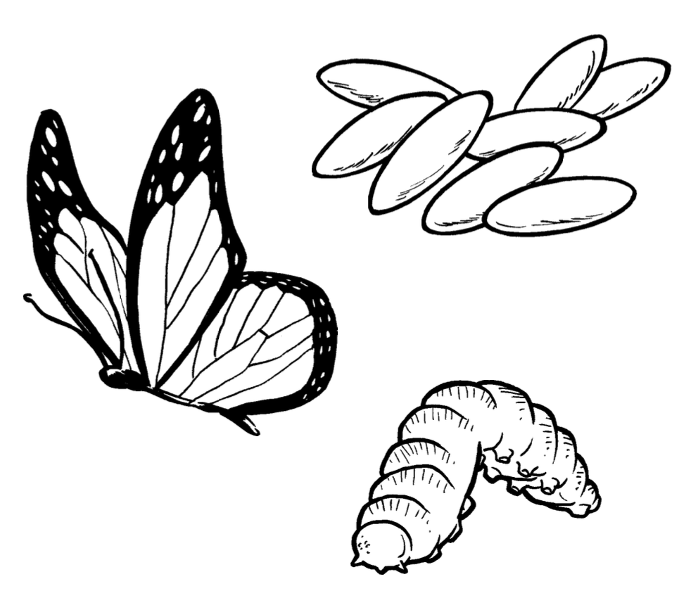

***

### 学生练习单

以下事物未按顺序排列。请根据它们所属顺序中发生的时间将其重新排列。从序列中的第一项开始。

| 乱序的事物                          | 按发生顺序从先到后排序 |
| --------------------------------- | ----------------------------- |
| 黄昏, 正午, 黎明, 午夜             |                               |
| 雷声, 洪水, 闪电, 雨              |                               |
| 时钟, 日晷, 太阳, 沙漏            |                               |
| 选举, 提名, 竞选活动               |                               |
| 创作, 排练, 表演                  |                               |
| 磨粉, 收割, 烘烤, 吃              |                               |
| 景观, 设计, 油漆, 建造            |                               |
| 汽车, 航天器, 飞机, 自行车        |                               |

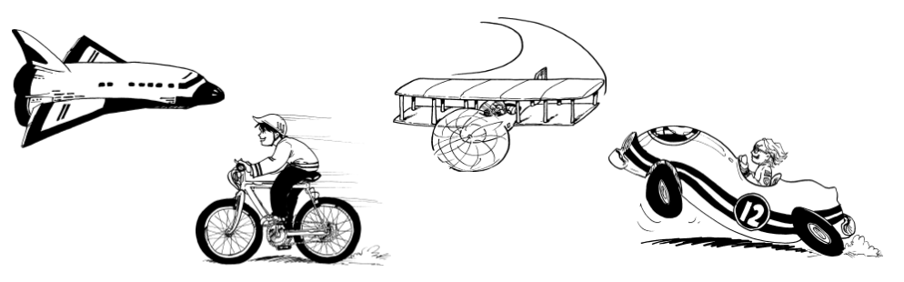

按时间排序时可问自己的有用问题

* &#x20;
* &#x20;

### 可能的答案

| 乱序的事物                          | 按发生顺序从先到后排序     |
| --------------------------------- | -------------------------------- |
| 黄昏, 正午, 黎明, 午夜             | 黎明, 正午, 黄昏, 午夜           |
| 雷声, 洪水, 闪电, 雨              | 闪电, 雷声, 雨, 洪水             |
| 时钟, 日晷, 太阳, 沙漏            | 太阳, 日晷, 沙漏, 时钟           |
| 选举, 提名, 竞选活动               | 提名, 竞选活动, 选举             |
| 创作, 排练, 表演                  | 创作, 排练, 表演                 |
| 磨粉, 收割, 烘烤, 吃              | 收割, 磨粉, 烘烤, 吃             |
| 景观, 设计, 油漆, 建造            | 设计, 建造, 油漆, 景观           |
| 汽车, 航天器, 飞机, 自行车        | 自行车, 汽车, 飞机, 航天器       |

#### 按时间排序时可问自己的有用问题

* 在其他事物发生之前，什么必须首先发生？

  
* 当所有其他事情都发生后，会发生什么？

***

# 思考概念

* 让我们思考一下我们如何发展 **想法** 或 **概念**。我们从一个简单的例子开始。
* 对于水果，有哪些属性或独特之处？
* 答案：皮、在树上生长、种子、汁液、甜味、有颜色，我们食用它们。
* 是否有任何水果不具备这些属性？让我们把它们从列表中划掉。柠檬不甜，菠萝/葡萄不在树上生长，有些葡萄没有种子。
* 所有剩下的属性都是**所有水果共有的**属性。我们称之为我们的**泛化**或**概念**，或者对**所有水果**的心理图像。&#x20;
* 如果我们必须向一个来自火星的人描述水果，这将是我们的泛化或概念图，因为它对**所有水果**都适用！
* 这里是另一个**概念**的例子。

## 示例

| 事物   | 属性                                                         |
| ------ | ------------------------------------------------------------ |
| 一只鸟 | 巢，产卵，两条腿，羽毛，尾巴，鸣叫，头部，无牙齿              |

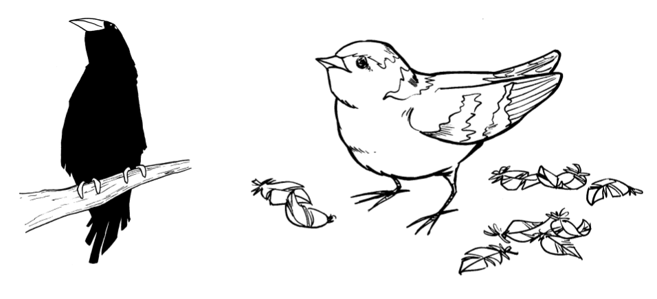

## 学生练习单

* 写下每种事物三条或以上的属性。
* 与同学一起为每种事物创建一个事实列表。
* 然后划掉不适用于你所考虑该事物所有示例的事实。
* 剩下的属性称为你的概念或对事物的泛化。

| **事物**     | **属性** |
| ------------ | -------- |
| 一个硬币     |          |
| 一张邮票     |          |
| 一辆汽车     |          |
| 一个正方形   |          |
| 一首诗       |          |
| 一颗行星     |          |
| 水果         |          |
| 一朵花       |          |
| 一个游戏     |          |
| 一种文化     |          |
| 树木         |          |

***

## 可能的答案

| 事物       | 属性                                                                                         |
| ---------- | -------------------------------------------------------------------------------------------- |
| 一个硬币   | 圆形，金属制，有日期，国家，正面人像，面值                                                     |
| 一张邮票   | 矩形，锯齿边缘，有日期，国家，价格，背面有胶                                                   |
| 一辆汽车   | 车轮，发动机，轮胎，方向盘，刹车，油箱                                                       |
| 一个正方形 | 4条直且相等的边，4个角，有面积，封闭图形，对角线                                               |
| 一首诗     | 文字，声音，意义，“意象”，可书写                                                           |
| 一颗行星   | 轨道，围绕太阳旋转，大气，球形，存在于太空，反射阳光，自转                                     |
| 水果       | 果皮，汁液，有颜色，我们食用它们                                                             |
| 一朵花     | 花瓣，颜色，叶子，香气，花蜜，雄蕊，吸引蜜蜂，花粉                                           |
| 一个游戏   | 规则，玩家，胜利者，得分，终点，乐趣                                                       |
| 一种文化   | 一群人的生活方式，有特定宗教，食物，服饰，习俗                                               |
| 树木       | 树枝，根，树干，树叶，树液                                                                 |

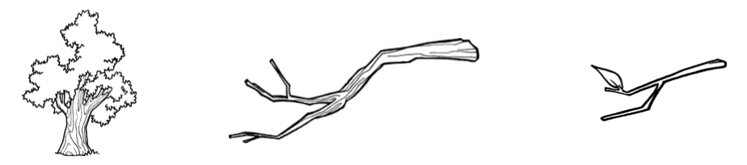

# 泛化

* 在第7课中，我们探讨了如何对某事物进行**泛化**或一般**概念**的构建。现在让我们进一步发展这一点。
* 想想你在书本中或现实生活中见过的所有**鸟**。
* 它们有什么共同点吗？这取决于你见过多少。但在你大脑的某处，你对鸟有一个形象：羽毛、喙、蛋、巢、飞行等等。这就是你对鸟的**泛化**或概念。
* 为什么我们要进行泛化？嗯，这就像一个模板或模型来指导我们的思维。它帮助我们认识新的鸟的例子，也帮助我们预测我们观察到的新鸟可能具备什么能力。

* 除了鸟之外，你还会在脑海中形成汽车、椅子、三角形和许多其他事物的心象。下文示例使用 ‘水果’ 作为概念。

## 示例

|                                                                         | 一些属性         |                |             |       |
| ----------------------------------------------------------------------- | --------------- | -------------- | ----------- | ----- |
| 水果                                                                    | 有色外皮        | 在树上生长     | 甜味        | 有种子 |
| 苹果                                                                    | 是              | 是             | 是          | 是     |
| 柠檬                                                                    | 是              | 是             | 否          | 是     |
| 草莓                                                                    | 是              | 否             | 是          | 是     |
| 香蕉                                                                    | 是              | 是             | 是          | 是     |
| 百香果                                                                  | 是              | 否             | 是          | 是     |
| 概括：水果通常具有颜色、外皮和种子。                                      |                 |                |             |       |

### 概括时可提出的有用问题

* 我能在脑海中想象出五个或更多此事物的例子吗？
* 这些例子的部分或特征有哪些？
* 我能列出来吗？&#x20;
* 哪些部分或特征在我列表中的所有例子中都是共有的？

***

## 学生练习单&#x20;

1. &#x20;写下你所知道的**所有****硬币**例子共有的四个或更多属性或特征。这些是关于硬币的概括。 ________________________________________________________________________________________________________________________________________________________________________

2. 写下你所知道的**所有****邮票**例子共有的四个或更多属性或特征。这些是关于邮票的概括。  
   ______________________________________________________________________________________________________________________________________________________________________

3. 写下五到十个**运动**的例子。现在尽可能多地写下这些运动的属性或特征。当你完成后，划去任何不适用于你给出的所有例子的特征。剩下的特征即为你对所有运动的概括。 ________________________________________________________________________________________________________________________________________________________

属性。  ____________________________________________________________________________

概括  ____________________________________________________________________________

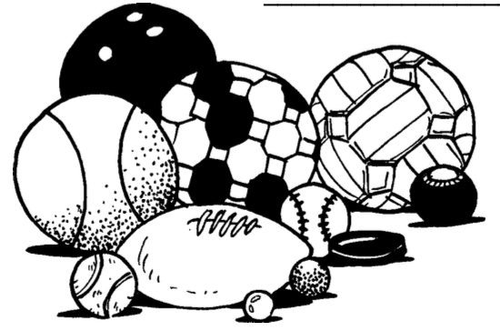

在接下来的第 4 至第 6 题中，如果所给示例包含列顶所示属性，则填写“是”；如果不包含该属性，则填写“否”。对于每道题，所给的所有示例都共有哪些属性？

*

|         | 一些属性      |      |       |            |     |          |
| ------- | ------------- | ---- | ----- | ---------- | --- | -------- |
| 哺乳动物 | 腿            | 游泳 | 肺    | 温血       | 飞行 | 脊柱     |
| 人类    |               |      |       |            |     |          |
| 鲸鱼    |               |      |       |            |     |          |
| 狗      |               |      |       |            |     |          |
| 蝙蝠    |               |      |       |            |     |          |

概括：

***

*

| 金属   | 导电 | 固体 | 有磁性 | 易熔 |
| ------ | ---- | ---- | ------ | ---- |
| 铁     |      |      |        |      |
| 铝     |      |      |        |      |
| 锡     |      |      |        |      |
| 汞     |      |      |        |      |

概括：

***

*

| 昆虫 | 6条腿 | 3个身体部分 | 触角 | 翅膀 | 眼睛 |
| ---- | ------ | ----------- | ---- | ---- | ---- |
| 草   |        |             |      |      |      |
| 跳虫 |        |             |      |      |      |
| 甲虫 |        |             |      |      |      |
| 苍蝇 |        |             |      |      |      |
| 蚂蚁 |        |             |      |      |      |
| 蜜蜂 |        |             |      |      |      |

概括：

***

### 当进行概括时可用于自我提问的有用问题

* &#x20;

*

***

## 可能的答案&#x20;

1. 所有硬币通常由金属制成，圆形、扁平、坚硬，并有刻印日期。

2. 所有邮票通常正面印有国家名称、由纸制成、具有锯齿边缘，以及印有日期和面值。

3) 所有体育运动通常都有运动员、双方、规则、胜者和裁判。

| 哺乳动物 | 腿  | 游泳 | 肺  | 温血 | 飞行 | 脊柱 |
| -------- | --- | ---- | --- | ---- | ---- | ---- |
| 人类     | 是  | 是   | 是  | 是   | 否   | 是   |
| 鲸鱼     | 否  | 是   | 是  | 是   | 否   | 是   |
| 狗       | 是  | 是   | 是  | 是   | 否   | 是   |
| 蝙蝠     | 是  | 否   | 是  | 是   | 是   | 是   |

概括：所有哺乳动物都有肺、温血和脊柱。&#x20;

*

| 金属   | 导电 | 固体 | 有磁性 | 易熔 |
| ------ | ---- | ---- | ------ | ---- |
| 铁     | 是   | 是   | 是     | 否   |
| 铝     | 是   | 是   | 否     | 是   |
| 锡     | 是   | 是   | 否     | 否   |
| 汞     | 是   | 否   | 否     | 是   |

概括：所有金属都能导电。

*

| 昆虫 | 6条腿 | 3个身体部分 | 触角 | 翅膀 | 眼睛 |
| ---- | ------ | ----------- | ---- | ---- | ---- |
| 草   | 是     | 是          | 是   | 是   | 是   |
| 跳虫 |        |             |      |      |      |
| 甲虫 | 是     | 是          | 是   | 是   | 是   |
| 苍蝇 |        | 是          | 是   |      |      |
|      | 是     | 是          | 是   |      |      |
| 蚂蚁 | 是     | 一些        | 是   |      |      |
|      | 是     | 是          |      |      |      |
| 蜜蜂 | 是     | 是          | 是   | 是   | 是   |

概括：所有昆虫都有6条腿、3个身体部分、触角和眼睛。

***

# 概念图

在介绍了我们如何创建概念（第1-8课）之后，让我们考虑如何在纸上进行组织。一个重要的思维工具是“图示总结”或**概念图**。

任何主题中的关键术语都可以通过图形来表示！它们最好在一个图示总结图中进行总结，该图展示了概念或过程中的不同要素之间的关系。研究表明，**可视化映射**能够提高记忆和理解。为什么？因为关键术语及其关联变得清晰（与不太相关的细节分离）。

  
一个好的图解摘要能替代你数百字的撰写。概念图简化并阐明了概念或过程的要点，从而帮助你清晰思考。

## 一些常见的概念图形状包括：

* 重叠圆圈：比较 2 个术语
* 层次结构：将一个大术语拆分为越来越小的部分
* 鱼骨图：多个术语作为原因导致一个结果
* 辐射图：描述中心术语的多个方面
* 流程图：讨论线性过程的各个阶段
* 循环图：讨论循环过程的各个阶段
* 表格：比较 3 种或更多事物
* 交互图：描述人或事物之间的相互作用

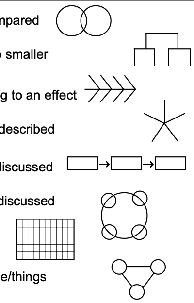

它是如何工作的？你需要先确定主要术语或关键词，然后将它们写在图示或地图中。市面上有不同形状的概念图，因此最好选择一种形状与阅读材料中想法的形状相匹配的概念图。

## 学生练习单

请看下面的图解摘要示例。

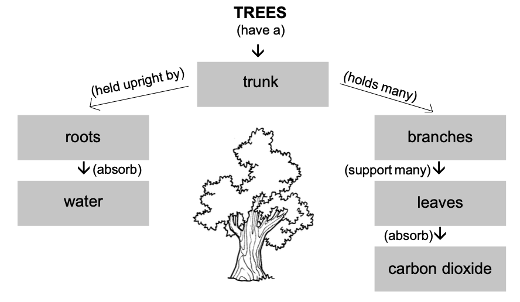

1. 在下面的概念图中填入缺失的词语 (?)

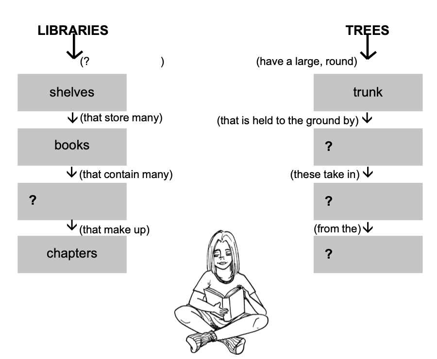

***

* 完成此摘要图。

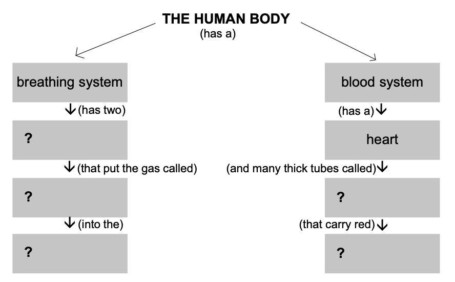

3. 尝试为以下术语制作一个摘要图：**边、四边形、对角线、正方形、矩形、角**

4. 看下面用于比较两项事物的摘要表。它用于总结并澄清两项事物的异同。

| 只有猫 | 两者都有 | 只有狗 |
| ------- | -------- | ------- |
|         |          |         |

* 在下面的摘要表中填写一些自行车和汽车的特点。

| 只有汽车 | 两者都有 | 只有自行车 |
| --------- | -------- | ----------- |
|           |          |             |

***

**6a)**. 阅读下面关于蛾和蝴蝶的文章。划出任何有趣且值得记忆的特征。现在将这些事实写入下面摘要表的相应栏中，以澄清事实。

**蝴蝶和蛾**

蝴蝶和蛾之间有许多区别。蝴蝶色彩鲜艳，白天飞行。大多数蛾在夜间活动。蝴蝶的触角末端有球状突起，但大多数蛾则没有。蝴蝶和蛾的翅膀上覆盖着细小的鳞粉。鳞粉非常脆弱，触碰翅膀时会掉落。大多数毛毛虫以叶子为食。有些会对农作物造成严重破坏。衣蛾的幼虫以羊毛、毛皮和羽毛为食。一些成虫蛾和蝴蝶会吸食花朵中的花蜜。其他成虫则不进食，产卵后不久就会死亡。

它们色彩鲜艳，白天飞行。大多数蛾在夜间活动。蝴蝶的触角末端有球状突起，但大多数蛾则没有。蝴蝶和蛾的翅膀上覆盖着细小的鳞粉。鳞粉非常脆弱，触碰翅膀时会掉落。大多数毛毛虫以叶子为食。有些会对农作物造成严重破坏。衣蛾的幼虫以羊毛、毛皮和羽毛为食。一些成虫蛾和蝴蝶会吸食花朵中的花蜜。其他成虫则不进食，产卵后不久就会死亡。

蝴蝶或蛾的一生有四个阶段：卵、幼虫（毛毛虫）、蛹和成虫。幼虫是幼体或幼小的昆虫，具有柔软的类蛆虫状身体。头部后方有三对真足，尾部有好几对假足（或称附足）。

在一段时间的进食后，毛毛虫形成蛹。蝴蝶的蛹称为蝶蛹。蝶蛹是一个坚硬的外壳，成虫就在其中发育。当成虫发育完成后，就会爬出蛹。大多数蛾的幼虫在化蛹前会在体周纺绕丝茧。家蚕的茧可用于制作丝绸面料。

| 只有蛾 | 两者都有 | 只有蝴蝶 |
| ------- | -------- | --------- |
|         |          |           |

**6b)**. 看下面的图解摘要图，用于总结一个循环过程的各个阶段。注意循环的关键阶段以及连接这些阶段的几个词语。

  
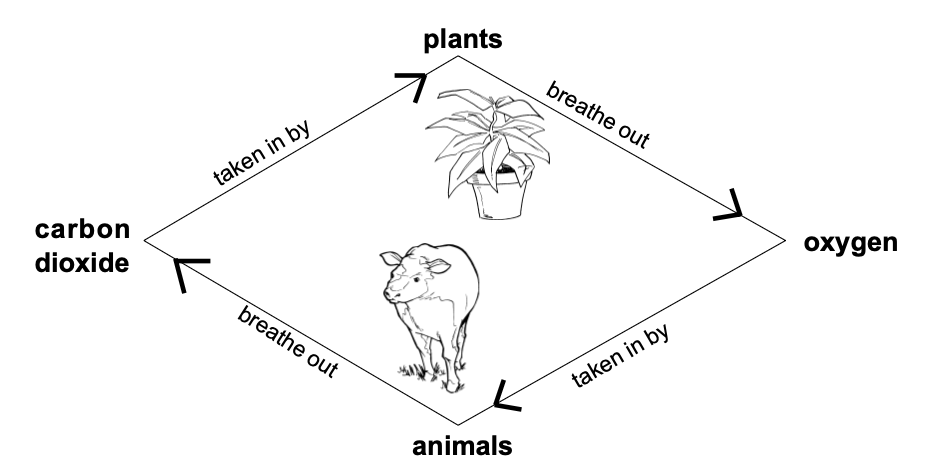

**循环摘要图**

* 阅读关于飞蛾和蝴蝶的文章。选择术语 BUTTERFLIES，并尝试找出蝴蝶生命周期中经历的另外三个阶段。

* 绘制一个循环图。将 butterflies 写在位置 1。将紧随 “butterflies” 之后的阶段写在位置 2。然后将这个阶段之后的阶段写在位置 3，最后将第 4 阶段写在位置 4。在每条箭头旁写几个字，以示从一个阶段形成下一个阶段时发生的事情。

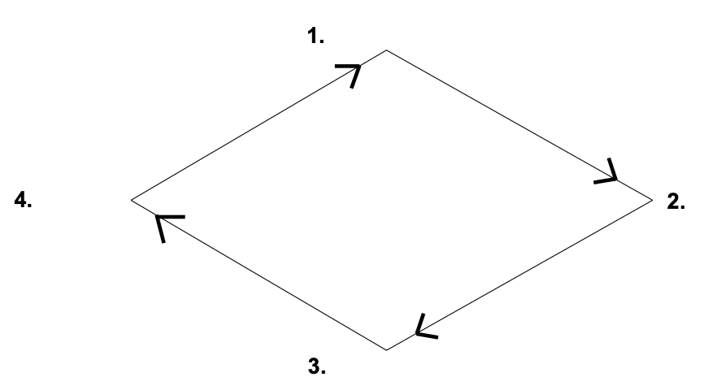

***

## **Possible answers**&#x20;

1. 在下面的概念图中填写缺失的单词（?）。

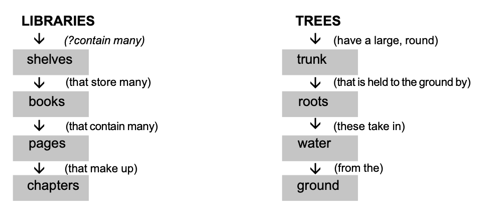

* 完成此摘要图。

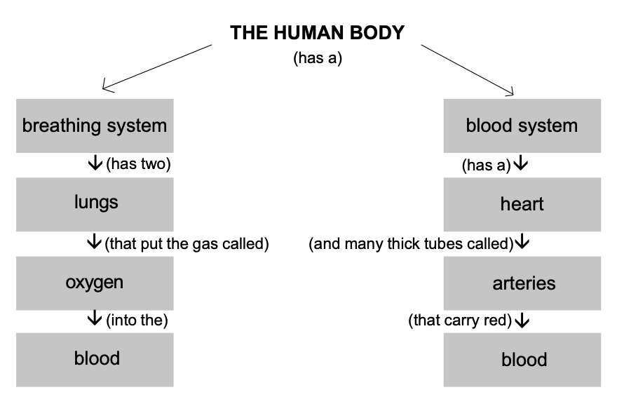

* 尝试为以下术语制作一个摘要图：  
  &#x20;                 边, 四边形, 对角线, 正方形, 长方形, 角

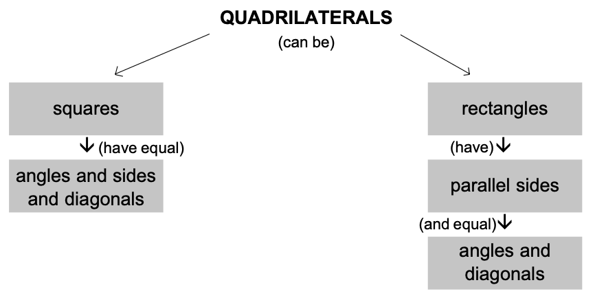

4. 查看用于比较两者的图片摘要图。它可用于总结和阐明两者之间不同以及相同的方面。

| 仅限猫         | 两者都      | 仅限狗       |
| ------------- | ---------- | ---------- |
| 爬树           | 有血液      | 吠叫         |
| 喵喵叫         | 四条腿      | 生幼崽       |
| 毛发较长       | 家养宠物    | 喜欢骨头     |

* 在下面的图片摘要图中填写一些自行车和汽车的特征。

| 仅限汽车    | 两者都   | 仅限自行车    |
| ------------ | ------- | ------------- |
| 发动机        | 灯      | 车把          |
| 化油器        | 刹车    | 小座椅        |
| 挡风玻璃      | 车轮    | 链齿轮        |
| 变速箱        | 车轴    | 踏板          |
| 仪表板        | 速度计  | 辐条          |
| 登记/牌照     |         |               |

***

* a). 阅读有关飞蛾和蝴蝶的文章。划出任何有趣且值得记住的特征。现在将这些事实写入下面的图片摘要图的正确列中，以总结和阐明这些事实。

| 仅限飞蛾                          | 两者都         | 蝴蝶                      |
| --------------------------------- | -------------- | ------------------------- |
|                                   | 触角           | 触角上的球状突起          |
| 无触角球状突起，颜色暗淡          | 翅膀上有鳞片   | 颜色鲜艳                  |
| 毛毛虫啃食衣物                    | 产卵           | 毛毛虫啃食&#xA;叶子       |
| 夜间活动                          | 吸食花蜜       | 白天活动                  |

**b)** 绘制一个循环图。将 butterflies 写在位置 1。将紧随 “butterflies” 之后的阶段写在位置 2。然后将这个阶段之后的阶段写在位置 3，最后将第 4 阶段写在位置 4。在每条箭头旁写几个字，以示从一个阶段形成下一个阶段时发生的事情。

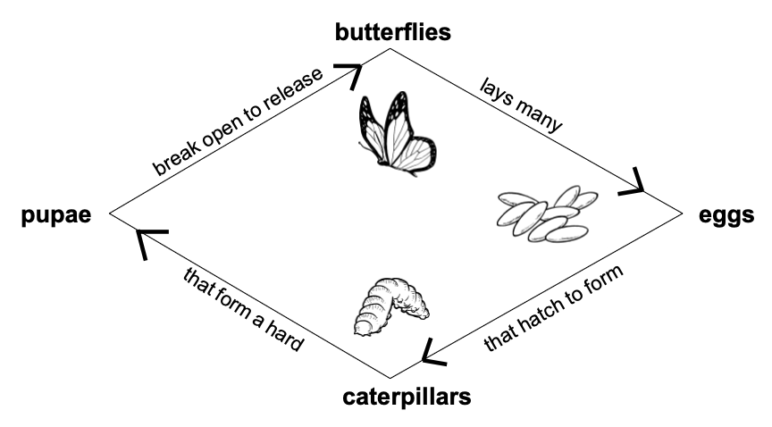

***

# 分析关系

* 将概念组合在一起是思维的基础（第1-9课）。将概念分解（**分析**）同样至关重要。当面对原始数据或信息时，我们必须将其分解（**分析**）。

* 这个练习中的问题经常出现在智力测验中。

* 优秀的思考者能够快速分析较小事物与其所属更大事物之间的关系。

## 示例 1

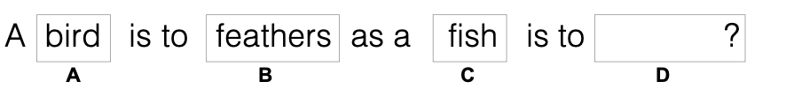

为了找到 D，我们必须首先弄清楚，或**分析** A 和 B 之间的关系。羽毛与鸟之间有什么关系？答案：羽毛**覆盖鸟的身体**。因此，为了让 D 与 C 有相同的关系，我们必须找到 D，或者说，找到覆盖 C（鱼）身体的东西。

为了找到 fin&#x64;**&#x20;D** 我们必须首先弄清楚，或**分析** **A&#x20;**&#x61;nd **B&#x20;**&#x61;之间的关系。羽毛与鸟之间有什么关系？答案：羽毛**覆盖鸟的身体**。因此，为了让**D**与 C 保持相同的关系，我们必须找到**D**，或者，找出**覆盖** **身体**的**C**（鱼）。

## 示例 2

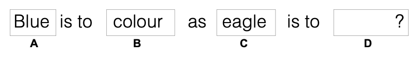

蓝色是颜色的一个**例子**。鹰是鸟类的一个**例子**。

***

## 学生练习单

  
* A 与 B 在以下各项中的关系是什么？  
* C 必须与 D 形成相同的关系。  
* 当你找出 D 时，将其填写在给定的行上。  

| A         | 之于 | B         | 如同 | C         | 之于  | D |
| --------- | ----- | --------- | ---- | --------- | ------ | - |
| 胃        | 之于 | 食物      | 如同 | 肺        | 之于  |   |
| 三角形    | 之于 | 三        | 如同 | 正方形    | 之于  |   |
| 圆        | 之于 | 球体      | 如同 | 正方形    | 之于  |   |
| 艺术家    | 之于 | 工作室    | 如同 | 法官      | 之于  |   |
| 太阳      | 之于 | 恒星      | 如同 | 土星      | 之于  |   |
| 橡树      | 之于 | 落叶的    | 如同 | 松树      | 之于  |   |
| 动脉      | 之于 | 血液      | 如同 | 神经      | 之于  |   |
| 总统      | 之于 | 国家      | 如同 | 市长      | 之于  |   |
| 视网膜    | 之于 | 眼睛      | 如同 | 心室      | 之于  |   |
| 热量      | 之于 | 能量      | 如同 | 推动      | 之于  |   |
| 唱 (原形) | 之于 | 唱 (过去式)| 如同 | 骑 (原形) | 之于 |   |
| 去 (过去式)| 之于 | 动词      | 如同 | 狗 (名词) | 之于  |   |

### 在分析关系时可自问的有用问题

* &#x20;  
*  

## **可能的答案**

| A                     | 之于 | B         | 如同 | C                     | 之于 | D          |
| --------------------- | ----- | --------- | ---- | --------------------- | ----- | ---------- |
| 胃                    | 之于 | 食物      | 如同 | 肺                    | 之于 | 空气       |
| （使用/吸收食物）     |       |           |      | （使用空气）          |       |            |
| 三角形                | 之于 | 三        | 如同 | 正方形                | 之于 | 四         |
| （有三条边）          |       |           |      | （有四条边）          |       |            |
| 圆                    | 之于 | 球体      | 如同 | 正方形                | 之于 | 立方体     |
| （是一个平面/二维球体）|       |           |      | （是一个平面/二维立方体）|     |            |
| 艺术家                | 之于 | 工作室    | 如同 | 法官                  | 之于 | 法庭       |
| （在工作室工作）      |       |           |      | （在法庭工作）        |       |            |
| 太阳                  | 之于 | 恒星      | 如同 | 土星                  | 之于 | 行星       |
| （恒星的例子）        |       | 常绿的    |      | （行星的例子）        |       |            |
| 橡树                  | 之于 | 落叶的    | 如同 | 松树                  | 之于 | 电的       |
| 动脉                  | 之于 | 血液      | 如同 | 神经                  | 之于 | 信号       |
| 总统                  | 之于 | 国家      | 如同 | 市长                  | 之于 | 城市       |
| 视网膜                | 之于 | 眼睛      | 如同 | 心室                  | 之于 | 心脏       |
| 热量                  | 之于 | 能量      | 如同 | 推动                  | 之于 | 力         |
| 唱 (原形)             | 之于 | 唱 (过去式)| 如同 | 骑 (原形)             | 之于 | 骑 (过去式)|
| 去 (过去式)           | 之于 | 动词      | 如同 | 狗 (名词)             | 之于 | 名词       |

### **在分析关系时可问的有用问题**

* 第二个事物如何与第一个事物相关，例如大小、颜色、用途、材料、部件、形状、示例等？&#x20;  
* 在同样的方式中，与 C（或第三个事物）相关的是什么？  

***

# 分析序列中的模式

* 在这里，我们将查看一些字母和数字序列。你需要写出每个序列的最后一个成员。  
* 仔细观察每个序列的前三个成员。  
* 分析第二个成员相对于第一个成员如何变化。&#x20;  
* 现在第三个成员相对于第二个成员如何变化？  
* 对第三个成员进行相同的变化，以找到第四个成员。  

## 示例

**2 6 10 ?**

第二个成员（6）是第一个成员（2）加上 4。  
第三个成员（10）是第二个成员（6）加上 4。&#x20;  
第四个成员应该是第三个成员（10）加上 4，即 14。

**Abc Abd Abe?**

第二个成员……最后一个字母从 C 增加到 D。  
第三个成员……最后一个字母从 D 增加到 E。  
第四个成员应该是 ABF……AB 保持不变，但最后一个字母从 E 变为 F。

  
  
## 学生练习单

填写这些序列中缺失的项。当教师提问时，大声向全班讲述你在寻找缺失项时的思考过程。

| 1.  | AA      | BB      | CC      | ······· |             |
| --- | ------- | ------- | ------- | ------- | ----------- |
| 2.  | AC      | CC      | EC      | ······· |             |
| 3.  | BYB     | СYС     | ······· | EYE     |             |
| 4.  | AAAW    | ······· | AAAY    | AAAZ    |             |
| 5.  | OOXX    | ....... | QQXX    | RRXX    |             |
| 6.  | ZZAA    | YYAA    | ......  | WWAA    |             |
| 7.  | AC      | ....... | EC      | GC      |             |
| 8.  | CAH     | CBH     | CCH     | ......  |             |
| 9.  | ....... | BFGB    | CFGC    | DFGD    |             |
| 10. | 4       | 9       | 14      | 19      | .......     |
| 11. | 3       | 4       | 6       | 7       | 9 10 ...... |
| 12. | 2       | 7       | 11      | 14      | ......      |
| 13. | 24      | 20      | 18      | 14      | ...... 8    |
| 14. | 2       | 4       | 8       | 16      | 32 ......   |
| 15. | 3       | 5       | 9       | 15      | ......      |

***

在每个序列中填入缺失的信息。

16.

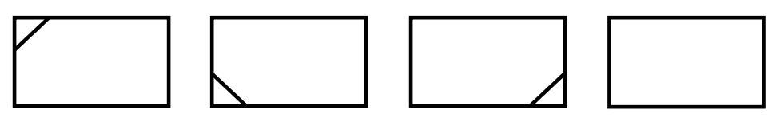

*

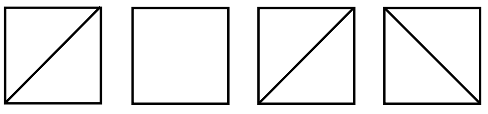

*

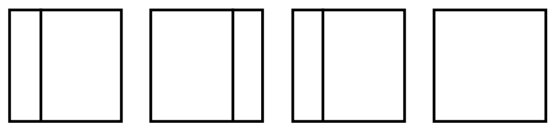

序列中缺失了什么？

*

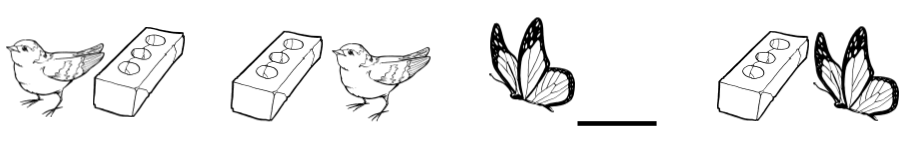

20.

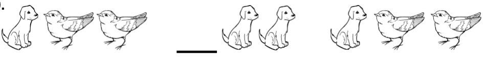

21.

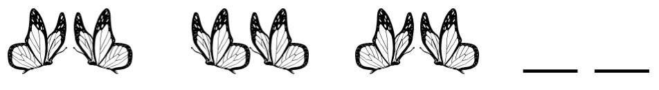

***

## 可能的答案

| 1.  | AA   | BB   | CC   | DD   |    |    |    |
| --- | ---- | ---- | ---- | ---- | -- | -- | -- |
| 2.  | AC   | сс   | EC   | GC   |    |    |    |
| 3.  | BYB  | СУС  | DYD  | EYE  |    |    |    |
| 4.  | AAAW | AAAX | AAAY | AAAZ |    |    |    |
| 5.  | OOXX | PPXX | QQXX | RRXX |    |    |    |
| 6.  | ZZ   | ҮҮ   | XX   | WW   |    |    |    |
| 7.  | AC   | сс   | EC   | GC   |    |    |    |
| 8.  | САН  | свн  | ссн  | CDH  |    |    |    |
| 9.  | AFGA | BFGB | CFGC | DFGD |    |    |    |
| 10. | 4    | 9    | 14   | 19   | 24 |    |    |
| 11. | 3    | 4    | 6    | 7    | 9  | 10 | 12 |
| 12. | 2    | 7    | 11   | 14   | 16 |    |    |
| 13. | 24   | 20   | 18   | 14   | 12 | 8  |    |
| 14. | 2    | 4    | 8    | 16   | 32 | 64 |    |
| 15. | 3    | 5    | 9    | 15   | 23 |    |    |

16.

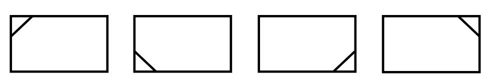

*

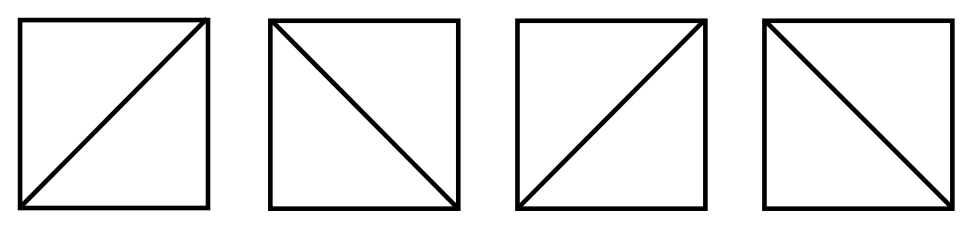

*

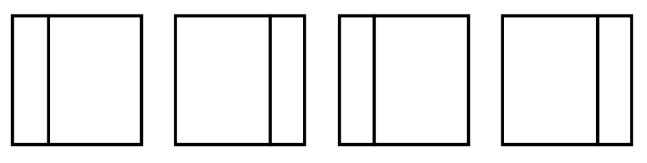

*

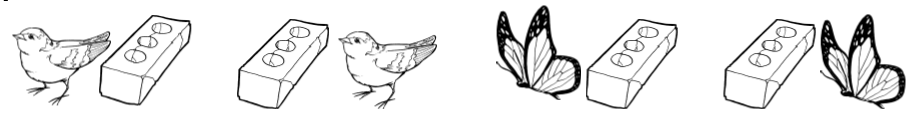

*

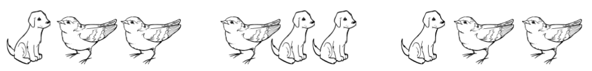

*

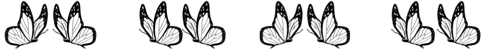

***

# 区分事实与观点

* 当你阅读报纸或杂志时，你是否认为每一句话都是事实？

* 如果不是，你如何判断哪些句子是**事实**，哪些是**观点**？

* 本课将帮助你学习一些批判性思考者用来区分事实与观点的实用问题。

* 在判定以下陈述哪些是事实、哪些是观点时，试着写下自己在做出每个判断时问自己的问题。

* 下面是一个有用的问题列表，下次当你想在阅读中区分事实和观点时可以参考。

1. 这个句子是否包含诸如 **could**、**may**、**might**、**possibly**、**predict** 和 **should** 等词？（观点）

2. 这句话能否通过**实验**或**证据**加以证明？如果可以——事实。如果不行——观点。

3. 这句话出自值得信赖的权威吗？（事实）

4. 这句话中的事情是真实发生过或正在发生的吗？（事实）

5. 这句话是否与某人的感受相关？（观点）

6. 这句话是否包含诸如 is、has、was、does 的词？（事实）

## 示例

英国首相是男性。事实

英国首相应该是男性。观点

***

## 学生练习单

报纸或杂志上的某些句子是事实（F），有些是观点（O）。这里的句子混合了这两种类型。请思考每个句子，并在每个句子后写上 **F** 或 **O**。

  
**1. **太阳比月亮大。

**2. **计算机有一天可能会变得像分子一样小。

**3. **2020 年美国总统将是一位男性。

**4. **太阳对我们比月亮更重要。

**5. **明年中国将发生大地震。

**6. **狗比猫更适合作为宠物。

**7. **昆虫有六条腿。

**8. **我们不应该使用核反应堆发电。

**9. **我们可以使用核反应堆发电。

**10. **男性比女性更适合做飞行员。

**11. **人类总有一天会居住在月球上。

**12. **乘飞机比在路上开车更安全。

**13. **科学比历史更难。

**14. **每个人都应该拥有一台计算机。

现在写下你在判断某事是事实还是观点时在心中提出的一些问题。与小组分享，并列出有助于你将来区分事实与观点的好问题清单。

一个陈述如果满足以下条件，则是事实：  
1.   
2.   
3.   
4.   
5.   

## 可能的答案

| 1. 太阳比月亮大。                         | 事实    |
| ----------------------------------------------------------- | ------- |
| 2. 计算机有一天可能会变得像分子一样小。    | 观点 |
| 3. 2020 年美国总统将是一位男性。 | 观点 |
| 4. 太阳对我们比月亮更重要。           | 观点 |
| 5. 明年中国将发生大地震。   | 观点 |
| 6. 狗比猫更适合作为宠物。                         | 观点 |
| 7. 昆虫有六条腿。                                   | 事实    |
| 8. 我们不应该使用核反应堆发电。  | 观点 |
| 9. 我们可以使用核反应堆发电。        | 事实    |
| 10. 男性比女性更适合做飞行员。                      | 观点 |
| 11. 人类总有一天会居住在月球上。                   | 观点 |
| 12. 乘飞机比在路上开车更安全。             | 事实    |
| 13. 科学比历史更难。                 | 观点 |
| 14. 每个人都应该拥有一台计算机。                        | 观点 |

***

# 区分确定结论与不确定结论

* 许多人在看到或阅读某些信息时会轻易下结论。  
* 我们称之为“读懂言外之意”。  
* 他们在进行推理，或做出不确定的结论。  
* 他们在没有确凿证据支持的情况下，就自行得出结论。  
* 广告设计者通过制作会让人得出错误结论的标题来“吸引”观众。  
* 下面是一些示例。不要轻易下结论。  

一个女孩看到一只狗喘着气，舌头耷拉着。她可能会得出以下结论：  

1. 它渴了。 **推断**  
2. 它刚进行了一次快速奔跑。 **推断**  
3. 它生病了。 **推断**  
4. 它的舌头耷拉着。 **确定结论，因为直接观察**  

唯一可以确定的结论是第4点。对于前三个结论，没有任何证据！  

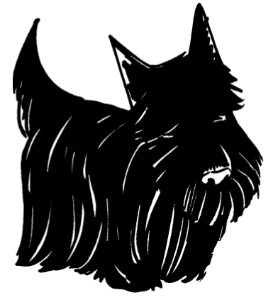

## 学生练习单

1. 在此广告中，你可以**确定**什么？圈出两个含糊不清或可以有不同解释的词。  
   在复活节星期五，Sainsbury's 的所有商品将以半价出售。  

2. 一个男人看到一个男孩快速跑出商店。他撞倒了一位女孩，却没有停下来帮忙。以下哪两项是你**可以确定**的？请圈出。  
   a) 那位女孩正要进商店。  
   b) 该男孩因某种原因迟到了。  
   c) 该男孩曾经在店里。  
   d) 那个男人看到了女孩被撞倒。  

3. 早上，布朗先生发现一些苹果从树上掉到了地上。请圈出你认为布朗先生**可以确定**的两项前面的数字。  
   a) 夜间的风把苹果吹落了。  
   b) 地上有苹果。  
   c) 明天地上会有更多苹果。  
   d) 苹果已经太熟了。  
   e) 有动物把它们撞落了。  
   f) 树上仍然有苹果。  

 
4\. 对于以下各事件写出**两条**人们可能提出的结论来解释该事件。选择其中任意一条作为你的结论，并说明需要哪些证据才能证明它是正确的结论。  
a) 当你打开手电筒时，它无法工作。  
结论 1：  
结论 2：  
我选择的结论：  
证明该结论所需的证据：  
学生练习单 b) 五金店正在进行清仓大甩卖。  
结论 1：  
结论 2：  
我选择的结论：  
证明该结论所需的证据：  
c) 熊猫正在灭绝。  

结论 1：  
结论 2：  

我选择的结论：  
证明该结论所需的证据：  

### 在区分确定性 (DEFINITE) 与不确定性 (INDEFINITE) 结论时可以问自己的有用问题  

*  

* &#x20;  

* &#x20;  

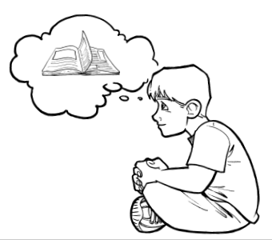  

***

## 可能的答案

1. 在此广告中，你可以肯定什么？圈出两个模糊或可以有不同解释的词。

(EVERYTHING)WILL BE SOLD AT CITY SAINSBURY'S FOR(HALF PRICE)ON EASTER FRIDAY.

一切过时商品还是受风暴损坏的商品？

半价是相对于哪个价格？

正常价格的两倍？

* 一个男人看到一个男孩迅速跑出商店。他撞倒了一个女孩却没有停下来帮助。以下哪两项是你可以确定的？圈出它们。  
c) 男孩曾在商店里。  直接可观察到  
d) 那个男人看到女孩被撞倒。  直接可观察到

* &#x20; 早上布朗先生发现有几个苹果从他的树上掉到了地上。圈出你认为布朗先生可以肯定的两件事前的号码。  
b) 地上有苹果。  直接可观察到  
f) 树上仍有苹果。  直接可观察到

* 对于以下各事件，写出**两条**人们可能提出的结论来解释该事件。选择其中任意一条作为你的结论，并说明需要哪些证据才能证明它是正确的结论。

**a**) 当你打开手电筒时，它无法工作。

结论 1：灯泡损坏  结论 2：电池没电  
我选择的结论：2    证明所需证据：换新电池试试  
**b**) 五金店正在进行清仓大甩卖。

结论 1：老板去世  结论 2：老板破产  
我选择的结论：1    证明所需证据：询问店里的人

**c**) 熊猫正在灭绝。

结论 1：熊猫不易繁殖  结论 2：它们的食物快要耗尽  
我选择的结论：2    证明所需证据：询问动物园管理员或在互联网上查看食物是否短缺。

***

# 挑战主张的可靠性

我们经常在报纸上看到有人声称看到了不明飞行物或像大脚怪或尼斯湖水怪这样的奇异生物。你首先会问自己“这份报纸有多可靠？”或“写这篇文章的人有多可靠？”。在相信他们之前，我们自然想要一些**证据**。&#x20;

一个善于批判性思考的人会提出一些非常有用的问题，想要让提出主张的人来回答。现在是你思考用来判断主张可靠性的问题的机会。

## **示例**

在一篇报纸报道中，一名男子声称看到一个巨大的、发光的不明飞行物 (UFO)，它在他家前的海面上盘旋。下列哪些**三项**事实最能帮助你或其他人**相信**他的报道可能是真的？**圈出**你选择的**三项事实**前的字母。为什么其他观察并无帮助？&#x20;  
a) 海面很汹涌。  e) 他用旧双筒望远镜观看。  
b) 他看了十分钟。  f) 隔壁的朋友们也看到了。  
c) 那天是新月。  g) 该男子当时25岁。  
d) 当时正好是晚上10点。

**答案：**

* b)、e) 和 f。&#x20;

* a)、d) 和 g 对视野好坏没有帮助。&#x20;

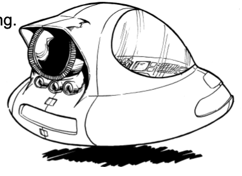

## **学生练习单**

在有助于你相信该主张的陈述前写上**Y**。

在让你怀疑该主张真实性的陈述前写 **N**。

在无法帮助你判断该主张的陈述前写 **O**。

主张：

1. 1960 年，托尔·麦克劳德声称他透过望远镜看到了尼斯湖水怪。  
2. 那个巨大的灰色物体位于对岸，约一英里远。  
3) 该湖非常深。  
4) 怪物前部有三条象鼻状突起。  
5. 麦克劳德当时没有任何朋友陪同。  
6. 他搬到该地区居住，是因为想在死前看到那个怪物。  
7) 他观察那个怪物约八分钟。  
8) 天气阴沉，多云，湖面飘着细雨。  
9. 他穿着一件新的大衣和帽子以保暖。  
10. 麦克劳德在目击到怪物后立即给报社打了电话。  
11) 该报纸刚被新业主收购。  

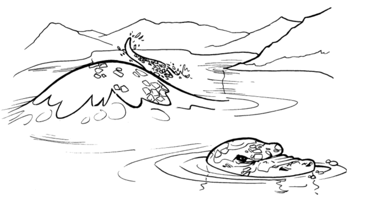

***

1\. 在帮助你相信该主张的陈述前写 **Y**。  
在让你怀疑该主张真实性的陈述前写 **N**。  
在无法帮助你判断该主张的陈述前写 **O**。  

**主张**：

1. 1957 年 11 月 2 日，在德克萨斯州莱维兰德，一家人声称看到了一个飞碟。  
2. 大约在晚上 10 点，它出现在他们汽车附近的地面上。  
3. 那辆车是新车，状况非常好。  
4. 这家人白天观看了一场空军表演后正在回家的路上。  
5. 他们观看那个飞碟大约五分钟。  
6. 几小时后，另一人在附近小镇看到了那个飞碟。  
7. 这家人说，当飞碟接近时他们的汽车发动机熄火了。  
8. 在他们观察时，该地区正有雷电风暴。  
9. 这家之父给当地报纸的编辑打了电话。  
10. 在那一周，报纸已经刊登了一系列关于飞碟的文章。  

### 在决定主张可靠性之前要问的有用问题

* &#x20;  
* &#x20;  
* &#x20;  
* &#x20;  

## 可能的答案

1. 1960 年，托尔·麦克劳德声称他透过望远镜看到了尼斯湖水怪。 **O**  
2. 那个巨大的灰色物体位于对岸，约一英里远。 **N**  
3. 该湖非常深。 **O**  
4. 怪物前部有三条象鼻状突起。 **N**  
5. 麦克劳德当时没有任何朋友陪同。 **N**  
6. 他搬到该地区居住，是因为想在死前看到那个怪物。 **N**  
7) 他观察那个怪物约八分钟。 **Y**  
8) 天气阴沉，多云，湖面飘着细雨。 **N**  
9. 他穿着一件新的大衣和帽子以保暖。 **O**  
10. 麦克劳德在目击到怪物后立即给报社打了电话。 **N**  
11) 该报纸刚被新业主收购。 **O**  

1. 1957 年 11 月 2 日，在德克萨斯州莱维兰德，一家人声称看到了一个飞碟。 **O**  
2. 大约在晚上 10 点，它出现在他们汽车附近的地面上。 **Y**  
3. 那辆车是新车，状况非常好。 **O**  
4. 这家人白天观看了一场空军表演后正在回家的路上。 **Y**  
5. 他们观看那个飞碟大约五分钟。 **Y**  
6. 几小时后，另一人在附近小镇看到了那个飞碟。 **Y**  
7. 这家人说，当飞碟接近时他们的汽车发动机熄火了。 **Y**  
8. 在他们观察时，该地区正有雷电风暴。 **N**  
9. 这家之父给当地报纸的编辑打了电话。 **N**  
10. 在那一周，报纸已经刊登了一系列关于飞碟的文章。 **N**  

***

### 在质疑主张可靠性时要问的有用问题

• 他/她是亲眼所见吗？当时的观测条件如何？  
• 还有其他人看见了吗？  
• 他/她在此事上是否有既得利益？  
• 他/她与现场的距离有多近？他/她是否立即报告了此事？ 

• 他/她当时神志清醒吗？

• 他/她受到同事的尊敬吗？

• 他/她之前是否就此事寻求公众关注？

• 他/她经验如何？

• 他/她当时是否服用过药物或饮酒？

# 区分相关信息与无关信息

某件事是 **相关的**，如果它与（你正在思考的任何事物）‘相连’。它可能对帮助你实现某个心中目的或目标很重要。例如，在选择新自行车时，需要考虑哪些相关因素？目标是选择一辆自行车。价格相关吗？是。购买时间段相关吗？否。你能想到的相关因素或事物越多，你的决策就会越好。首先你必须清楚你的目标是什么。然后你要识别什么是真正重要的以及原因。

## **示例**

想象一下，你丢失了你的狗。在下面关于你的狗的信息中圈出你认为能帮助人们找到它的 **三** 项最 **重要** 或最 **相关** 的内容。&#x20;

a) 你从哪里得到这只狗。 b) 这只狗的品种。&#x20;

c) 狗吃什么。 d) 狗晚上在哪里睡觉。  
e) 这只狗的颜色。 f) 这只狗的性别。  
g) 这只狗的高度。 h) 你的狗能跑多快。

**目标是：** 找到你丢失的狗

&#x20;事实 a) 对实现此目标有帮助吗？不！它并不重要。最重要的三项是 b)、e)、f) 或 g)。讨论。&#x20;

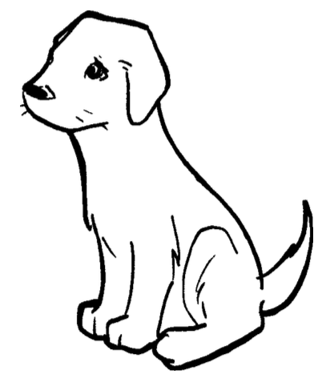

## 学生练习单

1. 你想申请一份课后送报纸的工作。经理让你写下一些关于自己的相关信息，以帮助他们考虑录用你。以下哪三项你认为最重要？

a) 我是左撇子。

b) 我擅长科学。

c) 我是个健康的人。

d) 我12岁。

e) 我是校篮球队队员。

f) 我住在附近。

g) 我有一辆新自行车。

* 你想购买一种对健康有益的早餐麦片。以下哪 **三** 项对帮助你做出选择最相关？

a) 盒子由再生纸制成。

b) 钢铁侠吃这种麦片。

c) 它含有高纤维。

d) 该公司是奥运会的赞助商。

e) 它味道很好。

f) 它不含任何防腐剂。

g) 它采用独立份量包装。

* 想象一下，你需要花费一大笔钱购买农场用地。在购买之前，你会考虑该土地哪些 **五** 项非常重要或相关的特性？

  1. &#x20;

  2. &#x20;

  3. &#x20;

  4. &#x20;

  5.

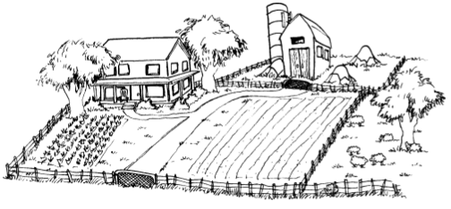

4. 你必须为 3 到 5 岁的儿童设计一个新玩具。这样的玩具应具备哪些 **五** 项非常重要或相关的特征？请为每个选择给出理由。

   1. &#x20;

   2. &#x20;

   3. &#x20;

   4. &#x20;

   5.

***

### 在区分相关与无关信息时可自问的有用问题

* &#x20;

* &#x20;

* &#x20;

## **可能的答案**

**问题 1：&#x20;**‌c), f) 和 g)

**问题 2：&#x20;**‌c), e) 和 f)

**问题 3：&#x20;**&#xA;&#x20;     土壤质量

**问题 4：&#x20;**

### 在区分相关与无关因素时可自问的有用问题

* 目标或主要目的是什么？

* 哪些选项的特征或属性可以帮助我实现此目标？

***

# 决策制定

决策制定是利用相关标准在给定的选项之间做出 **选择**。下面是一套有用的策略：

* 清楚你需要就什么事项做决策或在何者之间进行选择。你可以将“问题”或议题以提问的方式表达：  
  → 我会吃什么？&#x20;  
  →谁能帮助我完成家庭作业？&#x20;  
  →我如何交朋友？&#x20;  
  →我如何学会更好地打篮球？

* 确定可供选择的 **选项** 或替代方案。

我如何交朋友？&#x20;  
→通过付钱让人们喜欢我。&#x20;  
→给他们买礼物。&#x20;  
→给他们讲笑话。&#x20;  
→对每个人都友好。&#x20;  
→多微笑。

* 列出每个选项的**优点**和缺点。&#x20;

* 确定一些用于比较选项的相关**标准**。可以做到吗？是否诚实？是否合适？

* 使用这些标准比较你的选项。&#x20;

* 根据这些标准为每个选项评分。在每个标准下，1 = 差，2 = 一般，3 = 好。

* 通过选择最佳选项来做出决定，例如得分最高的选项。

## **做决定时可提出的有用问题**

* 我需要关于什么主要问题做决定？&#x20;

* 我可以在什么选项之间进行选择？&#x20;

* 每个选项的优缺点是什么？&#x20;

* 从中考虑哪些相关因素来做出决定？

* 我能否使用这些因素对我的选项进行评分 (3、2、1)？&#x20;

* 哪个选项的总体评分最高？

## 学生练习单

决策涉及在不同备选方案之间做出选择。

在此之前，你需要使用相关因素来比较你的选项。

要找出这些因素，你需要考虑每个选项的一些**优点**和一些缺点。

1. 你的父母会让你养一个家庭宠物。可选择的宠物包括鹦鹉、狗、蛇和兔子！写出拥有这些动物的一个优点和一个缺点。然后使用这些内容来确定一些在决定购买哪种宠物时需要考虑的**相关因素**。将你的因素与全班分享。

| Animal | Good thing | Bad thing |
| ------ | ---------- | --------- |
| parrot |            |           |
| dog    |            |           |
| snake  |            |           |
| rabbit |            |           |

Relevant factors to consider in making my decision:

\_\_\_\_\_\_\_\_\_\_\_\_\_\_\_\_\_\_\_\_\_\_\_\_\_\_\_\_\_\_\_\_\_\_\_\_\_\_\_\_\_\_\_\_\_\_\_\_\_\_\_\_\_\_\_\_\_\_\_\_\_\_\_\_\_\_\_\_\_\_\_\_\_\_\_\_\_\_\_\_\_\_\_\_\_\_\_\_\_\_\_\_\_\_\_\_\_\_\_\_\_\_\_\_\_\_\_\_\_\_\_\_\_\_\_\_\_\_\_\_\_\_\_\_\_\_\_\_\_\_\_\_\_\_\_\_\_\_\_\_\_\_\_\_\_\_\_\_\_\_\_\_\_

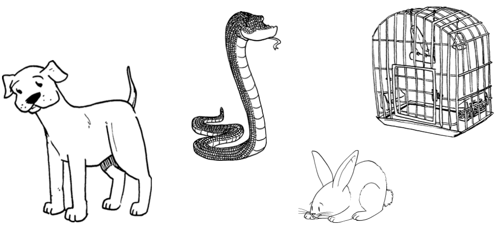

***

* 假设你可以选择成为一名医生、机械师、艺术家或教师。写下从事每一种职业的一个优点和一个缺点。然后使用这些内容来确定一些在决定你想从事哪种职业时需要考虑的相关因素。将你的因素与全班分享。

| **Job**  | **Good thing** | **Bad thing** |
| -------- | -------------- | ------------- |
| doctor   |                |               |
| mechanic |                |               |
| artist   |                |               |
| teacher  |                |               |

Relevant factors to consider in making my decision:

\_\_\_\_\_\_\_\_\_\_\_\_\_\_\_\_\_\_\_\_\_\_\_\_\_\_\_\_\_\_\_\_\_\_\_\_\_\_\_\_\_\_\_\_\_\_\_\_\_\_\_\_\_\_\_\_\_\_\_\_\_\_\_\_\_\_\_\_\_\_\_\_\_\_\_\_\_\_\_\_\_\_\_\_\_\_\_\_\_\_\_\_\_\_\_\_\_\_\_\_\_\_\_\_\_\_\_\_\_\_\_\_\_\_\_\_\_\_\_\_\_\_\_\_\_\_\_\_\_\_\_\_\_\_\_\_\_\_\_\_\_\_\_\_\_\_\_\_\_\_\_\_

* 想象你在一个荒岛上遇难，你必须在岛上某处搭建营地。列出你在做出选择时会考虑的岛上不同地点的一些因素或特征。例如，靠近河流或水源。将你的因素分享出来。

| Factors to consider   | Reason why factor important |
| --------------------- | --------------------------- |
| 1. closeness to water | need to drink every day     |
| 2.                    |                             |
| 3.                    |                             |
| 4.                    |                             |

* 如果你负责为一个城镇选择新机场的选址，你会考虑不同地点的一些重要或相关因素是什么？

| 需要考虑的因素         | 该因素重要的原因             |
| ------------------- | --------------------------- |
| 1.                  |                             |
| 2.                  |                             |
| 3.                  |                             |
| 4.                  |                             |

5. 回到练习 1。在此表中列出你的比较因素。现在，如果某动物在该因素上表现**差**或**不好**，给它 **1** 分；如果表现一般，给它 **2** 分；如果表现**好**，给它 **3** 分。哪种动物得分最高？这是你的选择吗？为什么另一种动物可能是更好的选择？

| 因素            | 鹦鹉   | 狗   | 蛇     | 兔子   |
| ------------- | ------ | --- | ----- | ------ |
|               |        |     |       |        |
|               |        |     |       |        |
|               |        |     |       |        |
|               |        |     |       |        |
| 总得分：      |        |     |       |        |

我的选择：

***

做出决策时可自问的有用问题

* &#x20;

*

***

## 可能的答案

1.

| **动物** | **优点**                | **缺点**        |
| -------- | ----------------------- | -------------- |
| 鹦鹉     | 会说话，漂亮             | 吵闹，脏乱     |
| 狗       | 友好，可牵引/散步        | 食物昂贵       |
| 蛇       | 安静，不脏乱             | 无聊           |
| 兔子     | 安静，吃剩菜             | 脏乱           |

**在做出我的决定时需要考虑的相关因素**：噪音水平、脏乱程度、食物成本、兴趣水平。

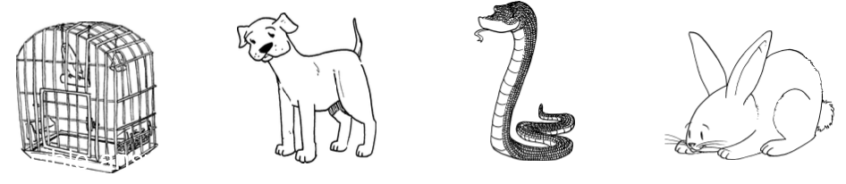

*

| 工作      | 优点                   | 缺点               |
| -------- | --------------------- | ------------------ |
| 医生     | 高工资                | 长时间工作，压力大 |
| 机械师   | 在户外                | 脏乱，乏味         |
| 艺术家   | 干净，有趣             | 报酬低             |
| 教师     | 有趣，有假期           | 压力大             |

做出我的决定时需要考虑的相关因素：薪资、压力水平、兴趣水平、户外自由度、脏乱程度。

***

*

| **需要考虑的因素**       | **该因素重要的原因**       |
| --------------------- | ------------------------- |
| 1. 与水的距离          | 需要每天饮水              |
| 2. 可遮雨的庇护        | 保持干燥                  |
| 3. 靠近食物/礁石       | 需要进食/捕捞鱼类         |
| 4. 可视求助点          | 需要向船只/飞机发出信号   |

* &#x20;

| 需要考虑的因素       | 该因素重要的原因             |
| ------------------- | --------------------------- |
| 1. 距离城市的远近     | 公交费用                    |
| 2. 距离海洋的远近     | 坠机时的安全性              |
| 3. 远离住家           | 不打扰早晨                  |
| 4. 土地成本           | 项目费用                    |

* 动物

| 因素                   | 鹦鹉   | 狗   | 蛇     | 兔子   |
| ---------------------- | ------ | --- | ----- | ------ |
| 1. 食物成本低          | 1      | 1   | 3     | 2      |
| 2. 制造的脏乱少        | 1      | 2   | 3     | 2      |
| 3. 兴趣度高            | 2      | 3   | 1     | 1      |
| 4. 噪音水平低          | 1      | 2   | 3     | 3      |
| 总得分：               | 5      | 8   | 10    | 8      |

我的选择：蛇！也许有些因素比其他因素更重要。如何才能使它们更重要？

***

# 考虑其他观点

* 在争论中，大多数人只看到自己的观点。

* 他们不愿意听对方解释为何持有不同观点。一个好的批判性思考者更具包容性，并且至少愿意倾听对方的观点。

* 争吵甚至战争的起因是人们不愿意倾听其他观点。

* 如果他们这么做，可能会听到一些新事实，也可能理解他人的感受。

## 示例

世界上一些贫穷国家的人们正在砍伐大量森林。写下**两个**理由，以支持或同意他们砍伐森林的做法。

写出 **两个** 反对他们行为的理由。

**支持理由**：
1. 它为国家带来数百万美元，有助于公民的教育和医疗。
2. 它有助于为森林工业雇用数千人。

**反对理由：**
1. 它会导致土壤侵蚀，随雨水被冲走。
2. 这意味着大气中二氧化碳气体增多，因为树木吸收二氧化碳。反过来，这意味着空气温度上升。

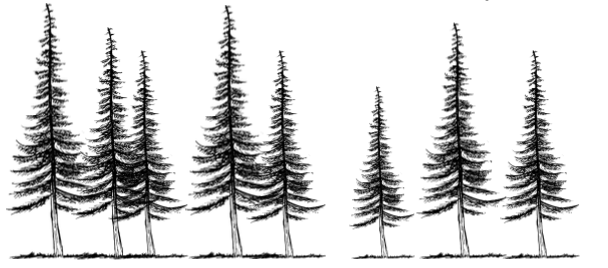

## 学生练习单

1. 有些人认为农民不应该在农作物上喷洒杀虫剂。  
农民认为他们应该这样做。  
写出 **两个** 理由说明农民为什么不应该喷洒杀虫剂，以及 **两个** 理由说明农民为什么应该喷洒杀虫剂。

**他们不应该的理由：**
*
*

**他们应该的理由：**
* &#x20;
*
  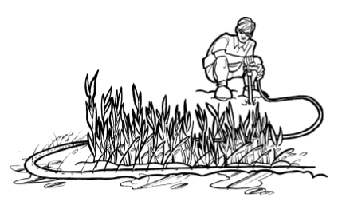

2. 有些人认为某些国家捕杀鲸鱼是不对的。捕杀鲸鱼的人认为他们应该被允许这么做。写出两个理由说明为什么人们不应该捕杀鲸鱼，以及两个理由说明为什么某些国家的人应该能够捕杀鲸鱼。&#x20;  
   **不应该捕杀鲸鱼的理由：**
*
*

**应该捕杀鲸鱼的理由：**
* &#x20;
* &#x20;

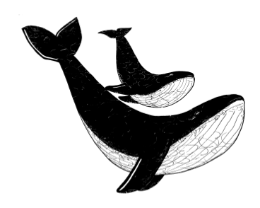

***

在考虑其他观点时，向自己提出的有用问题

* &#x20;
* &#x20;

***

## **可能的答案**

1. 有些人认为农民不应该在农作物上喷洒杀虫剂。  
农民认为他们应该这样做。写出 **两个** 理由说明农民为什么不应该喷洒杀虫剂，以及 **两个** 理由说明农民为什么应该喷洒杀虫剂。

Why They Shouldn'T:  
· 杀虫剂先毒死昆虫，然后毒死鸟类。&#x20;  
· 杀虫剂残留在作物表皮上：被人类食用。

Why they should:  
· 昆虫可能毁坏农作物。  
· 如果无法消灭害虫，农民就无法种植农作物。

2. 有些人认为某些国家捕杀鲸鱼是不对的。捕杀鲸鱼的人认为他们应该被允许这么做。写出两个理由说明为什么人们不应该捕杀鲸鱼，以及两个理由说明为什么某些国家的人应该能够捕杀鲸鱼。&#x20;  
   Why we shouldn't kill whales:  
* 一些鲸鱼将会灭绝。  
* 鲸鱼捕食的食物数量将危险地增加。

Why we should kill whales:  
* 一些文化依赖鲸肉作为食物。  
* 捕鲸业提供许多就业机会。

***

### 在考虑其他观点时要提出的有用问题

* 在这个问题上，我是否存在不公平的偏见？&#x20;
* 我是否知道在这个问题两方面的所有事实？
* 这个人为什么持有相反观点？
* 我为什么会有自己的观点？

# 提出更好的问题

* 大多数人发现很难就他们所谈论的内容向别人提出问题。
* 大多数学生倾向于等待回答而不是自己提问。- 然而，**你对所阅读或听到的内容能提出的问题越多**，就越有可能理解其含义。
* 当你提出问题时，你会更加专注，并将其与你已有的知识联系起来。
* **问题越好，思维越佳**，尤其是批判性思维。

七个基本的疑问词：&#x20;

如何？ 例如：电视如何影响公众舆论？  
为什么？ 例如：人们为什么撒谎？&#x20;  
什么？ 例如：该疾病的主要成因是什么？&#x20;  
在哪里？ 例如：我在哪里可以找到信息？&#x20;  
何时？ 例如：何时是制定计划的最佳时机？ 哪一个？ 例如：哪个是最佳选择？&#x20;  
谁？ 例如：我可以信任谁？

## 第一部分 为什么？或如何？问题生成器

### 学生练习单

1. 在每一行中写入 1 到 5 个单词以组成一个句子。

花 --- 种子。  
花 --- 叶子。  
花 --- 荆棘。  
花 --- 颜色。

现在在每个句子后面提“为什么？”或“如何？”，以提出一些问题。看看你如何能够针对任何事物提出有趣的问题！也许老师会在黑板上写出小组中 5 到 10 个最佳问题，让全班回答。

**答案：**

* &#x20;

* &#x20;

*

2. 对鲸鱼再做一次此操作。

鲸鱼 \_ 哺乳动物。  
鲸鱼 \_ 迁徙。  

鲸鱼 \_ \_ \_ \_ \_ \_ \_ \_ 鱼。  

鲸鱼 \_ 噪音。  

**答案：**

*  
* &#x20;

*

3. 对小组想要提出问题的其他几个主题重复此操作。将主题写在行首，将一些与该主题相关的重要词写在行尾。现在来看看如何对你所读的任何内容提出问题。

4. 阅读以下有关“昆虫”主题的段落。挑选出四个特别与昆虫有关的关键词。然后编造四个句子，以“昆虫”开头，以所选词汇结尾。

**昆虫**

昆虫是小型的六足动物。苍蝇、飞蛾和蚂蚁只是几种昆虫。昆虫头部有两根触角，用于感知气味。它们的身体由三个节段或部分组成，其中含有呼吸孔。昆虫有两对翅膀。有些昆虫对人类有益，有些则有害。大多数昆虫产卵数百枚。

昆虫 \_\_

昆虫 \_\_  
昆虫 \_\_

昆虫 \_\_

回答小组中关于昆虫的最佳问题。

## **第2部分&#x20;**&#x54;wo 词问题起始词

### 学生练习单

这是另一种提出自己问题的方法。

1. 从A行中选择你提问的第一个词。  
2. 从B行中选择你的第二个词。

| A. | What              | Where           | When  | Which | Who | Why | How |
| -- | ----------------- | --------------- | ----- | ----- | --- | --- | --- |
| B. | is/are/do did/was | would/could/can | might |       |     |     |     |

3. 现在用这些词开头来造句。

***

示例主题：CLOUDS

| What are    | clouds made of?             |
| ----------- | --------------------------- |
| Why are     | clouds of different shapes? |
| Who would   | be interested in clouds?    |
| Where might | you not find any clouds?    |
| How are     | clouds made?                |

Using the words in Row A and Row B, you should be able to make 30 or more interesting and different questions about clouds. Imagine the number of new connections in your brain about clouds!

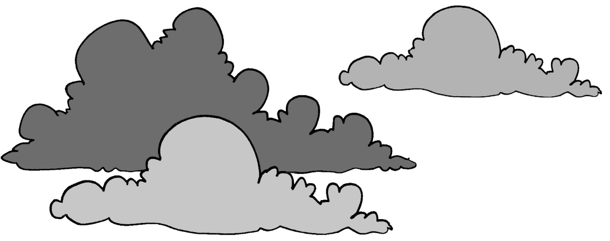

4. 以小组形式选择一个主题，例如 flowers、flies、birds、trees、sports。

* 每个人尝试就所选主题提出四个问题。  
* 使用来自A行和B行的不同问题起始词。  
* 将你的问题与小组分享，以获得大量小组问题。  
* 现在看看小组能回答多少。  
* 重复此任务，但选择另一个主题。

.

## 第1部分 “为什么？”或“如何？”问题生成器 

### **可能的答案** 

1. 花朵。

* 花朵有许多种子。为什么？因为当它们落到地面时，不会有许多存活，所以花朵需要许多种子。  
* 花朵被叶子包围着。为什么？花朵需要叶子吸收二氧化碳，作为花朵的养分。  
* 花朵有时会长刺。为什么？刺可以保护花朵免受野生动物的啃食。  
* 花朵有各种各样的颜色。为什么？花朵的颜色吸引大量蜜蜂，将花粉带到其他花朵进行授粉。

2. 鲸鱼。

* 鲸鱼是哺乳动物的例子。为什么？因为它们是温血动物，有脊柱，并且生下活体幼崽。  
* 鲸鱼长距离游动进行迁徙。为什么？因为它们要游到温暖水域生育幼崽。  
* 鲸鱼不是鱼类。为什么？因为鲸鱼有肺，而不是鳃。  
* 鲸鱼经常发出响亮的声音。为什么？为了吸引其他鲸鱼一起游动和交配。

3. 来自“昆虫”阅读的词汇：**触角、翅膀、有害、卵**

   1. 昆虫有两根长触角。为什么？昆虫利用触角来感知附近的物体和食物。
   2. 昆虫有两对翅膀。为什么？昆虫需要备用的翅膀，以防它们损坏翅膀。
   3. 昆虫有时是有害的。如何？有些昆虫会吃农作物、咬衣物、啃食木材。
   4. 昆虫产下数千枚卵。为什么？因为天敌会将它们作为食物，所以昆虫需要大量的卵。

***

# 创造性后果

* 创造性思维涉及摆脱或打破对事物的常规做法、制造、使用或思考方式。

* 实现这一点的一种方法是对某个主题进行天马行空的幻想或梦想。

* 年轻人在入学前的游戏中就擅长以这种方式进行思考。&#x20;

* 在此练习中，你可以思考一些不太可能或不可能事件发生的后果。&#x20;

* 你会注意到他人的想法与你不同。但像所有与创造性思维有关的问题一样，没有唯一正确的答案。

**示例**

如果世界上没有树木了……空气中的氧气就会减少……这意味着大城市里会有很多人死亡。

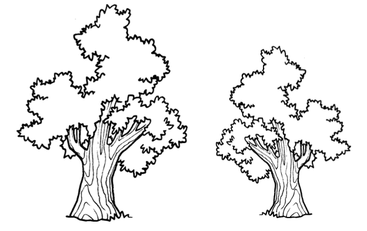

如果我们的电力耗尽……那将意味着计算机、电视等都无法使用，只剩面对面交流。

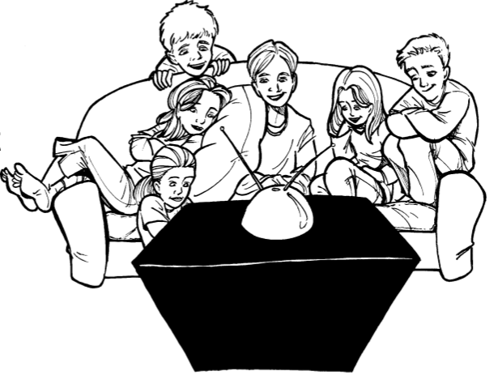

如果我决定无论如何都不再生气……那么我可能会交到更多朋友，也可能会更快乐。

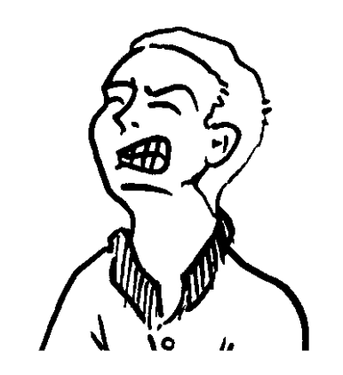

#

## 学生练习单

通过在空格中填入单词完成以下内容。

1. 如果世界上不再有鸟类，那么 \_\_\_\_\_\_\_\_\_\_\_\_\_\_\_\_\_\_\_\_\_\_\_\_\_\_\_\_\_\_\_\_\_\_\_\_\_\_\_\_\_\_ \_\_\_\_\_\_\_\_\_\_\_\_\_\_\_\_\_\_\_\_\_\_\_\_\_\_\_\_\_\_\_\_\_\_\_\_\_\_\_\_\_\_\_\_\_\_\_\_\_\_\_\_\_\_\_\_\_\_\_\_\_\_\_\_\_\_\_\_\_\_\_\_\_\_\_\_\_\_\_\_\_\_\_\_\_\_\_\_\_\_\_\_\_\_\_\_\_\_\_\_\_\_\_\_\_\_\_&#x20;
   而这意味着 \_\_\_\_\_\_\_\_\_\_\_\_\_\_\_\_\_\_\_\_\_\_\_\_\_\_\_\_\_\_\_\_\_\_\_\_\_\_\_\_\_\_\_\_\_\_\_\_\_\_\_\_\_\_\_\_\_\_\_\_\_\_\_\_\_\_

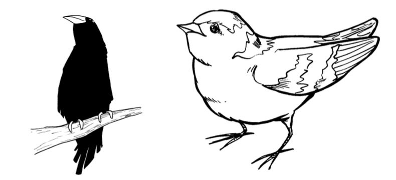

2. 如果地球不再有月亮，那么而这将意味着 \_\_\_\_\_\_\_\_\_\_\_\_\_\_\_\_\_\_\_\_\_\_\_\_\_\_\_\_\_\_\_\_\_\_\_\_\_\_\_\_\_\_ \_\_\_\_\_\_\_\_\_\_\_\_\_\_\_\_\_\_\_\_\_\_\_\_\_\_\_\_\_\_\_\_\_\_\_\_\_\_\_\_\_\_\_\_\_\_\_\_\_\_\_\_\_\_\_\_\_\_\_\_\_\_\_\_\_\_\_\_\_\_\_\_\_\_\_\_\_\_\_\_\_\_\_\_
   而这将意味着 \_\_\_\_\_\_\_\_\_\_\_\_\_\_\_\_\_\_\_\_\_\_\_\_\_\_\_\_\_\_\_\_\_\_\_\_\_\_\_\_\_\_\_\_\_\_\_\_\_\_\_\_\_\_\_\_\_\_\_\_\_\_\_\_\_\_

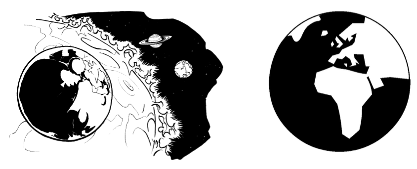

&#x20;3. 如果地球上不再有油田，那么 \_\_\_\_\_\_\_\_\_\_\_\_\_\_\_\_\_\_\_\_\_\_\_\_\_\_\_\_\_\_\_\_\_\_\_\_\_\_\_\_\_\_ \_\_\_\_\_\_\_\_\_\_\_\_\_\_\_\_\_\_\_\_\_\_\_\_\_\_\_\_\_\_\_\_\_\_\_\_\_\_\_\_\_\_\_\_\_\_\_\_\_\_\_\_\_\_\_\_\_\_\_\_\_\_\_\_\_\_\_\_\_\_\_\_\_\_\_\_\_\_\_\_\_\_\_
and this would mean \_\_\_\_\_\_\_\_\_\_\_\_\_\_\_\_\_\_\_\_\_\_\_\_\_\_\_\_\_\_\_\_\_\_\_\_\_\_\_\_\_\_\_\_\_\_\_\_\_\_\_\_\_\_\_\_\_\_\_\_\_\_\_\_\_\_

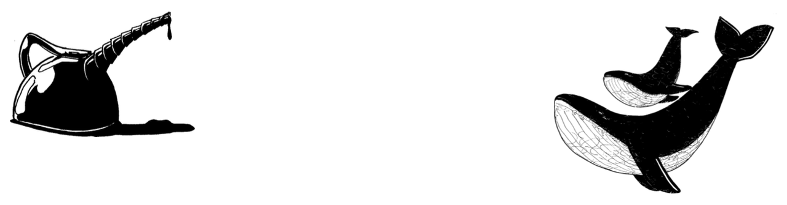

4. 如果地球上不再有鲸鱼，那么 \_\_\_\_\_\_\_\_\_\_\_\_\_\_\_\_\_\_\_\_\_\_\_\_\_\_\_\_\_\_\_\_\_\_\_\_\_\_\_\_\_\_\_\_\_\_\_\_\_\_
   \_\_\_\_\_\_\_\_\_\_\_\_\_\_\_\_\_\_\_\_\_\_\_\_\_\_\_\_\_\_\_\_\_\_\_\_\_\_\_\_\_\_\_\_\_\_\_\_\_\_\_\_\_\_\_\_\_\_\_\_\_\_\_\_\_\_\_\_\_\_\_\_\_\_\_\_\_\_\_\_\_\_\_\_\_\_
   而这将意味着 \_\_\_\_\_\_\_\_\_\_\_\_\_\_\_\_\_\_\_\_\_\_\_\_\_\_\_\_\_\_\_\_\_\_\_\_\_\_\_\_\_\_\_\_\_\_\_\_\_\_
   为班级制作更多有趣且富有想象力的 ‘if ____ then’ 句子，让学生完成。

***

## **可能的答案**&#x20;

1. 如果世界上没有鸟类，那么将会有更多的昆虫，这意味着植物的叶子被吃得更多。

2. 如果地球不再有月亮，那么就没有潮汐，这意味着海底不会翻动，鱼类无法觅食。

3. 如果地球上不再有石油储量，则无法生产汽油，这意味着汽车将变得无用。

4) 如果地球上不再有鲸鱼，就不会有捕鲸者，这意味着一些国家将不得不寻找其他肉类来食用，以及鲸油中其他的化学物质。

***

# 反向创造性思维

* 创造性思维者经常尝试与大多数人尝试的相反的想法。

  
* 他们尝试逆向思维。这会真正打破你大脑中已经固化的那些模式。
  
* 你的大脑记住了你能够拍摄的或你能看见的东西。但当它需要想出那些你无法拍摄或看不见的东西时，就会感到困难。本课将帮助你摆脱大脑中通常的模式。
  
## **Example**
  
**Question**: 列出三处你找不到空气的地方。  
  
**Answers**: 在太空中，在电灯泡内，在真空中，岩石内部。  
  
  
## Student worksheet
  
1\. 列出三件你无法用相机拍摄的事物。  
  
* &#x20;  
* &#x20;  
*  
  
2. 列举三种无需用手拿着就能打开书的方法。  
  
*  
*  
*  
  
3. 列举三种原因，说明为什么有人被看到倒着读报纸。  
  
*  
*  
*  
  
4. 汽车与树相同的三种方式是什么？  
  
*  
*  
*  
  
5. 列出三样在英国你找不到的东西。  
  
*  
*  
*  
***
  
## **Possible answers**
  
1\. 你无法拍摄的三件事：感觉、声音、宇宙、无限、地球核心、已故的人。  
  
2\. 三种无需使用双手打开书的方法：用嘴打开、用放在书页间的绳子拉开、用吸尘器、让别人帮你打开、使用一些棍子或刀叉。  
  
&#x20;3\. 列举三种原因说明为什么有人被看到倒着读报纸：他们在躲避某人、他们在遮阳、他们是盲人、只有最外层的页面是倒置的。  
  
4\. 汽车和树相同的三种方式：它们都吸入并释放气体、它们提供阴凉、它们有多种不同的类型、形状和颜色、它们都有许多部件，  
  
5\. 在英国你找不到的三样东西：恐龙、金字塔、迪士尼乐园、巨型红木树。  
  
***
  
# 分析设计的创造力
  
* 有创造力的人对周围的创造性保持敏感。  
* 也就是说，他们会注意人类或自然创造的事物的设计。  
* 我们周围的一切（狗、树、铅笔、我们自己、汽车）都有符合特定功能的设计。  
* 你越是仔细观察事物，并问自己为什么它具有特定的形状、颜色、尺寸、形状、材料、部件和硬度，就越能对创造力保持敏感。  
* 你问的问题正是最早创造这些事物的人脑海中出现的问题。  
  
## **Examples:**
  
**Question:** 为什么瓶子是由玻璃制成而不是其他材料？一定有理由说明最早制作瓶子的人为何选择玻璃这种材料。  
  
**Possible answers:**  
玻璃易于清洁，玻璃透明，因此我们可以轻松看到内部，玻璃易于熔化，便于吹制成瓶子的形状。  
  
**Question:**  
为什么网球是圆形的？  
  
**Possible answers:**  
这样它可以轻松滚动。  
  
**Question:**  
为什么网球软且中空？  
  
**Possible answers:**  
这样它就轻便，并且可以轻松击打（对球员没有危险）。  
  
  
## **Student worksheet**
  
关于你的所有事物都有符合特定目的的设计。甚至自然界的事物也是如此。如果设计不够优秀，自然或人类就会对其进行改进，以使设计真正符合其特定目的。你每天都在看东西，但是否曾问过为什么它具有这样的创意设计？现在就是你的机会。
  
1. 为什么铅笔通常有六个面，而不是三个或十个？  
2. 为什么一棵树有数千片叶子，而不是四五片？  
3. 为什么报纸的版面比书的页面要大得多？  
4) 为什么饮水杯是用陶土制成的，而不是钢制的？  
5) 为什么狗和猫有四条腿，而不是两条或六条？  
6) 为什么使用红色来表示危险或警示？  
7) 为什么轮胎是用橡胶制成的？  
8) 为什么叉子有四个叉齿，而不是两个或十个？  
9. 为什么硬币通常是圆形的？  
10. 为什么邮票通常是长方形的？  
11. 为什么交通标志通常是绿色背景上的白字或黑色背景上的黄色字？

12. 为什么鱼有鳞片？

13. 为什么硬币通常由铜制成？

Useful questions to ask myself when ANALYSING the CREATIVE DESIGNS of NATURE and HUMAN BEINGS

* &#x20;

*

## **可能的答案**&#x20;

1\. 为什么铅笔通常是六边形而不是三边形或十边形？

更易于握持、制造、存放在盒子里，而且不易滚动。

2. 为什么一棵树有数千片叶子，而不是只有四五片？

叶子是树的嘴巴和鼻子，用来吸收养分或二氧化碳。树无法像动物那样在地球上移动去收集食物。它们需要许多“嘴”（叶片上的气孔），因此需要大量的叶子来收集养分。&#x20;

* 为什么报纸的版面通常比书页大？&#x20;  
  为了使纸张更薄，不需要装订，制造和印刷成本更低，也更容易处理。

* 为什么饮用杯常用黏土而不是钢材？&#x20;  
  黏土握起来不会太烫，机器制造黏土杯更容易，且饮品的热量不易迅速散失。

* 为什么狗和猫都有四条腿，而不是两条或六条？&#x20;  
  跑得更快，两条腿用于抓握骨头/肉，六条腿难以协调。

* 为什么使用红色来表示危险或警示？  
  红色是对眼睛刺激性最强的颜色，能迅速引起注意。

* 为什么轮胎由橡胶制成？

灵活柔软，乘坐舒适，易于制造和修理，耐磨性好。8. 为什么叉子有四个叉齿而不是两个或十个？

四个叉齿能形成一个勺状以举起食物；十个叉齿之间难以清洁，而两个叉齿则无法形成勺状。

9. 为什么硬币通常是圆形的？

易于制造，无锋利的边缘，更易于存放，也易于放入机器中。

10. 为什么邮票通常是矩形的？

易于印刷，易于制作整张邮票，易于撕下整张，11. 为什么道路标志通常是白字绿底或黄字黑底？

白底绿色和黑底黄色是对眼睛对比度最高的配色，也最容易被注意到。

12. 为什么鱼有鳞片？

鳞片能保持鱼体温暖，便于在水中流动，并且难以被抓住。

13. 为什么硬币通常由铜制成？

铜不会生锈，铜合金坚固且不易弯曲。

### 有用的问题：&#x20;

为什么这个东西有某些**SCUMPS**？

***

# 来自随机物体的创造力

该策略适用于创意问题解决、创意写作和创意产品设计。它通过无关联对象的意外联系帮助你跳脱常规思维模式。

1. 想一个与当前任务毫不相关的物体。

2. 写下该物体的五个左右特征。

3. 尝试一次使用一个特征，与待解决的问题、写作或产品进行创新联想以进行改进。并非所有随机输入的特征都具有用处。

## 示例

**任务 1：**  
为了解决肮脏的校园操场问题。&#x20;

**随机物体：** 铅笔

**特征：** 尖锐、有色、六边形形状、木质、'铅芯'、易断。

**解决方案：**

* 将操场划分为不同颜色的区域。每个班级负责维护其对应颜色区域的清洁。

* 在操场上被发现乱扔垃圾的学生必须佩戴**彩色**、**六边形**徽章一天。

**任务 2：**  
用于在故事中描述一个人。

**随机物体：** 铅笔

**特征：** 尖锐、有色、六边形形状、木质、'铅芯'、易断。&#x20;

**描述：**  
警官先生有一张尖锐的鼻子和六边形的面庞，当他生气时会变成各种颜色。他走路时仿佛长着木制的腿。

**任务 3**

用于改进饮用玻璃杯的设计。

随机物体：铅笔

特征：尖锐、有色、六边形形状、木质、'铅芯'、易断。

**改进：**

* 使玻璃杯具有**六角形**或六个面。为套装中的每个玻璃杯使用不同的颜色，以帮助人们识别自己的杯子；将它们放置在**木制**托架中，便于从厨房搬运。

***

## 学生练习单

**任务 1：**&#x20;

  
写一个足球运动员的简短描述。

随机对象: 一个汽车轮胎

特征: 橡胶质、厚重、易磨损、圆形、嘈杂、粗糙，（添加更多）。

你的描述:（包含上述词语）  
足球运动员杰克\_\_\_\_\_\_\_\_\_\_\_\_\_\_\_\_\_\_\_\_\_\_\_\_\_\_\_\_\_\_\_\_\_\_\_\_\_\_\_\_\_\_\_\_\_\_\_\_\_\_\_\_\_\_\_\_\_\_\_\_\_\_\_\_\_\_\_\_\_\_\_\_\_\_\_\_\_\_\_\_\_\_\_\_\_\_\_\_\_\_\_\_\_\_\_\_\_\_\_\_\_\_\_\_\_\_\_\_\_\_\_\_\_\_\_\_\_\_\_\_\_\_\_\_\_\_\_\_\_\_\_\_\_\_\_\_\_\_\_\_\_\_\_  

\_\_\_\_\_\_\_\_\_\_\_\_\_\_\_\_\_\_\_\_\_\_\_\_\_\_\_\_\_\_\_\_\_\_\_\_\_\_\_\_\_\_\_\_\_\_\_\_\_\_\_\_\_\_\_\_\_\_\_\_\_\_\_\_\_\_\_\_\_\_\_\_\_\_\_\_\_\_\_\_\_\_\_\_\_\_\_\_\_\_\_\_\_\_\_\_\_\_\_\_\_\_\_\_\_\_\_\_\_\_\_\_\_\_\_\_\_\_\_\_\_\_\_\_\_\_\_\_\_\_\_\_\_\_\_\_\_\_\_\_\_\_\_  

**任务 2：**  
改进一包早餐麦片的设计，使其更具销售力。

随机对象：一朵花

对象特征：不同的颜色、有香味、带种子、花瓣、不同的形状，（添加更多）。

对设计的创意改进建议\_\_\_\_\_\_\_\_\_\_\_\_\_\_\_\_\_\_\_\_\_\_\_\_\_\_\_\_\_\_\_\_\_\_\_\_\_\_\_\_\_\_\_\_\_\_\_\_\_\_\_\_\_\_\_\_\_\_\_\_\_\_\_\_\_\_\_\_\_\_\_\_\_\_\_\_\_\_\_\_\_\_\_\_\_\_\_\_\_\_\_\_\_\_\_\_\_\_\_\_\_\_\_\_\_\_\_\_\_\_\_\_\_\_\_\_\_\_\_\_\_\_\_\_\_\_\_\_\_\_\_\_\_\_\_  

**任务 3：**  
如何减少城市道路上的汽车数量。

随机对象：一份报纸

对象特征：页数、新闻、数字、索引、纵横填字游戏、图片，（添加更多）

解决方案：\_\_\_\_\_\_\_\_\_\_\_\_\_\_\_\_\_\_\_\_\_\_\_\_\_\_\_\_\_\_\_\_\_\_\_\_\_\_\_\_\_\_\_\_\_\_\_\_\_\_\_\_\_\_\_\_\_\_\_\_\_\_\_\_\_\_\_\_\_\_\_\_\_\_\_\_\_\_\_\_\_\_\_\_\_\_\_\_\_\_\_\_\_\_\_\_\_\_\_\_\_\_\_\_\_\_\_\_\_\_\_\_\_\_\_\_\_\_\_\_\_\_\_\_\_\_\_\_\_\_\_\_\_\_\_  

# 视觉创造力

我们的头脑主要记住常见的形状（模式）以及这些形状所代表的内容。通过观察人们如何通过跳出固定模式来灵活思考，我们能够学会对想法和模式进行灵活思考。

在以下五分钟练习中，你将获得一个分数。

分数：  
**0-3** 类别的想法表明灵活性（创造力）较低  
**4-7** 类别表明灵活性平均  
**8+** 类别表明灵活性较高

**可能性：**  
甜甜圈  
轮胎  
靶心  
人的眼睛  
戒指  
钟表  
门把手  
帽子，从上方向下看  
指南针  
盒式磁带  
胶带  
按钮  
茶托/盘子  
光盘  
等等

***

## 学生练习单

1. 在五分钟内，写下尽可能多的不同事物，这幅线描图可能代表的含义。然后我们换纸，你的搭档会标记出你所有可接受的答案。这些答案必须由大多数同学一致认可。

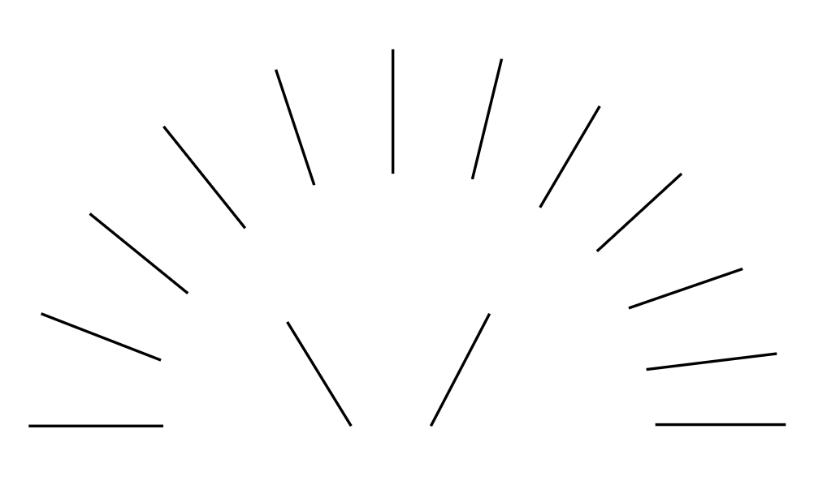

2. 在五分钟内，写下尽可能多的不同事物，这幅线描图可能代表的含义。然后我们换纸，你的搭档会标记出你所有可接受的答案。这些答案必须由大多数同学一致认可。

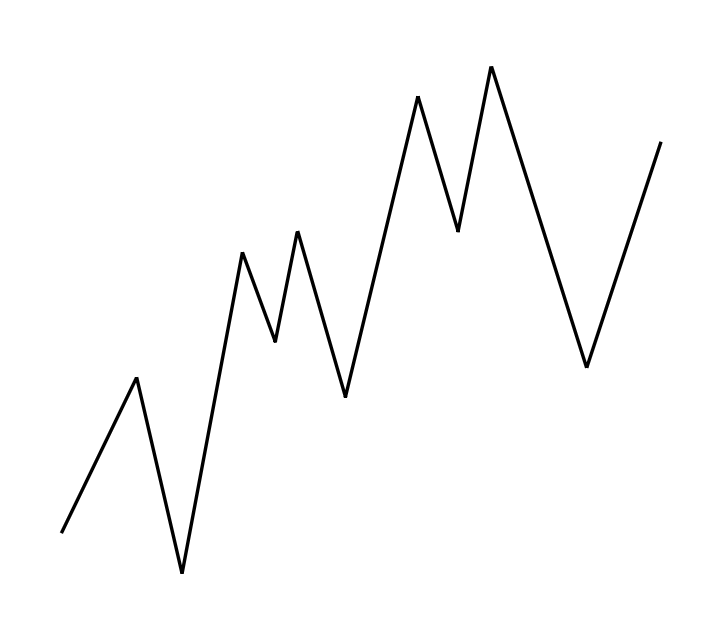

# 关于用途的创造性思维

* 这是一个帮助你更灵活思考某物用途的练习。  
* 大脑记住了砖块的常见用途是建造墙壁、房屋、建筑物等，这些都属于**垂直结构**的范畴。  
* 创造性或灵活的思维者可以打破常用用途，思考其他类别的用途。

写下桌子的所有可能用途。

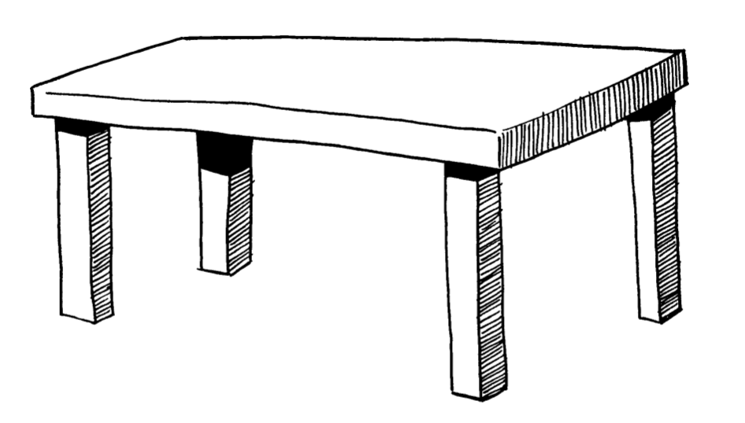

写下桌子的所有属性（或特征），然后列举其他也具有该属性的事物。

| 属性 | 可能的用途 |
| ---------- | ------------- |
|            |               |
|            |               |
|            |               |
|            |               |
|            |               |
|            |               |
|            |               |

## 学生练习单

1\. 在五分钟内写下你能想到的所有常见和不常见的砖块用途。这些用途应彼此明显不同。&#x20;  
砖块的特征或属性： \_\_\_\_\_\_\_\_\_\_\_\_\_\_\_\_\_\_\_\_\_\_\_\_\_\_\_\_\_\_\_\_\_\_\_\_\_\_\_\_\_\_\_\_\_\_\_\_\_\_\_\_\_\_\_\_\_\_\_\_\_\_\_\_\_  
\_\_\_\_\_\_\_\_\_\_\_\_\_\_\_\_\_\_\_\_\_\_\_\_\_\_\_\_\_\_\_\_\_\_\_\_\_\_\_\_\_\_\_\_\_\_\_\_\_\_\_\_\_\_\_\_\_\_\_\_\_\_\_\_\_\_\_\_\_\_\_  
\_\_\_\_\_\_\_\_\_\_\_\_\_\_\_\_\_\_\_\_\_\_\_\_\_\_\_\_\_\_\_\_\_\_\_\_\_\_\_\_\_\_\_\_\_\_\_\_\_\_\_\_\_\_\_\_\_\_\_\_\_\_\_\_\_\_\_\_\_\_\_  
\_\_\_\_\_\_\_\_\_\_\_\_\_\_\_\_\_\_\_\_\_\_\_\_\_\_\_\_\_\_\_\_\_\_\_\_\_\_\_\_\_\_\_\_\_\_\_\_\_\_\_\_\_\_\_\_\_\_\_\_\_\_\_\_\_\_\_\_\_\_\_  
可能的用途： \_\_\_\_\_\_\_\_\_\_\_\_\_\_\_\_\_\_\_\_\_\_\_\_\_\_\_\_\_\_\_\_\_\_\_\_\_\_\_\_\_\_\_\_\_\_\_\_\_\_\_\_\_\_\_\_\_\_\_\_\_\_\_

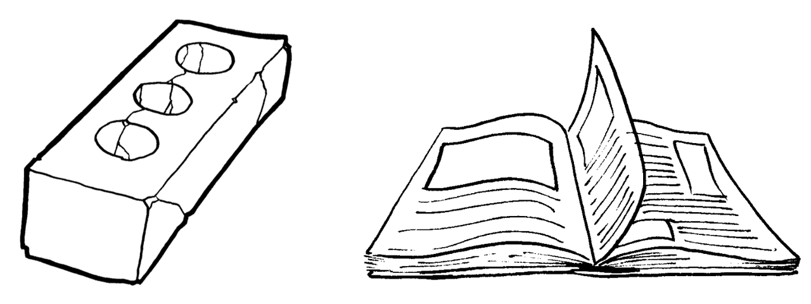

&#x20;2\. 在五分钟内写下你能想到的所有常见和不常见的报纸用途。用途应彼此明显不同。  
报纸的特征： \_\_\_\_\_\_\_\_\_\_\_\_\_\_\_\_\_\_\_\_\_\_\_\_\_\_\_\_\_\_\_\_\_\_\_\_\_\_\_\_\_\_\_\_\_\_\_\_\_\_\_\_\_\_\_\_\_\_\_\_\_\_  
\_\_\_\_\_\_\_\_\_\_\_\_\_\_\_\_\_\_\_\_\_\_\_\_\_\_\_\_\_\_\_\_\_\_\_\_\_\_\_\_\_\_\_\_\_\_\_\_\_\_\_\_\_\_\_\_\_\_\_\_\_\_\_\_\_\_\_\_\_\_\_  
\_\_\_\_\_\_\_\_\_\_\_\_\_\_\_\_\_\_\_\_\_\_\_\_\_\_\_\_\_\_\_\_\_\_\_\_\_\_\_\_\_\_\_\_\_\_\_\_\_\_\_\_\_\_\_\_\_\_\_\_\_\_\_\_\_\_\_\_\_\_\_  
\_\_\_\_\_\_\_\_\_\_\_\_\_\_\_\_\_\_\_\_\_\_\_\_\_\_\_\_\_\_\_\_\_\_\_\_\_\_\_\_\_\_\_\_\_\_\_\_\_\_\_\_\_\_\_\_\_\_\_\_\_\_\_\_\_\_\_\_\_\_\_  
可能的用途： \_\_\_\_\_\_\_\_\_\_\_\_\_\_\_\_\_\_\_\_\_\_\_\_\_\_\_\_\_\_\_\_\_\_\_\_\_\_\_\_\_\_\_\_\_\_\_\_\_\_\_\_\_\_\_\_\_\_\_\_\_\_\_

  
3. 在五分钟内写下你能想到的所有线绳的常见和不寻常的用途。 这些用途应彼此有明显差异。  

线绳的特征： ________________________________________________________________  
____________________________________________________________________________  
____________________________________________________________________________  
____________________________________________________________________________  
____________________________________________________________________________  

线绳的可能用途： ____________________________________________________________  
____________________________________________________________________________  
____________________________________________________________________________  
____________________________________________________________________________  
____________________________________________________________________________  

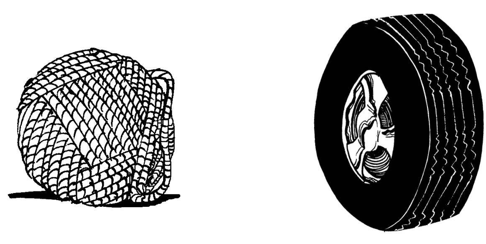  

4. 在五分钟内写下你能想到的所有汽车轮胎的常见和不寻常的用途。 这些用途应彼此有明显差异：&#x20;  
   汽车轮胎的特征： ____________________________________________________________  
   ____________________________________________________________________________  
   ____________________________________________________________________________  
   ____________________________________________________________________________  
   ____________________________________________________________________________  

Possible uses for a car tyre: ____________________________________________________  
______________________________________________________________________________  
______________________________________________________________________________  
______________________________________________________________________________  
______________________________________________________________________________

  
## **可能的答案**

**1**. 在5分钟内写出砖块的所有可能用途。

用途...**粗糙** - 磨料, **沉重** - 武器, 锤子, 门挡, 镇纸, 举升, **带孔** - 铅笔筒, 昆虫之家, **直边** - 尺子, 边界, 建造垂直墙面, 铺设路径, **笨重** - 可用来站立或坐下, 水槽斜坡, 轮胎楔块, 支撑, **有色** - 作记号。

**2**. 在5分钟内写出报纸的所有可能用途。

用途...**多孔** - 清洁窗户, 吸干墨水或水分, **大面积** - 覆盖窗户, 覆盖地面, 包裹食物, 包书 **轻** - 制作风筝, 生火, **灵活** -
包裹玻璃, 填充鞋子。

**3**. 在5分钟内写出一段绳子的所有可能用途。

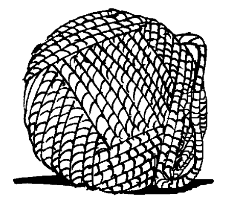

纤细 - 鞋带, 鱼线, 晾衣绳, 书签。

**4**. 在5分钟内写出汽车轮胎的所有可能用途。

**圆形** - 可滚动的环, 植物围栏, 秋千座, **弹性** - 用于停靠码头的船只, 铺设道路, 赛车碰撞护障, **笨重** - 作为鱼类栖息的轮胎礁。

&#x20;

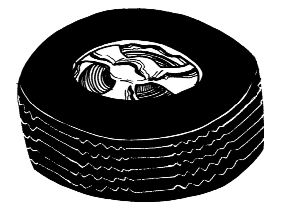

0-3 思维灵活性低, 4-7 思维灵活性一般, 8+ 思维灵活性良好。
